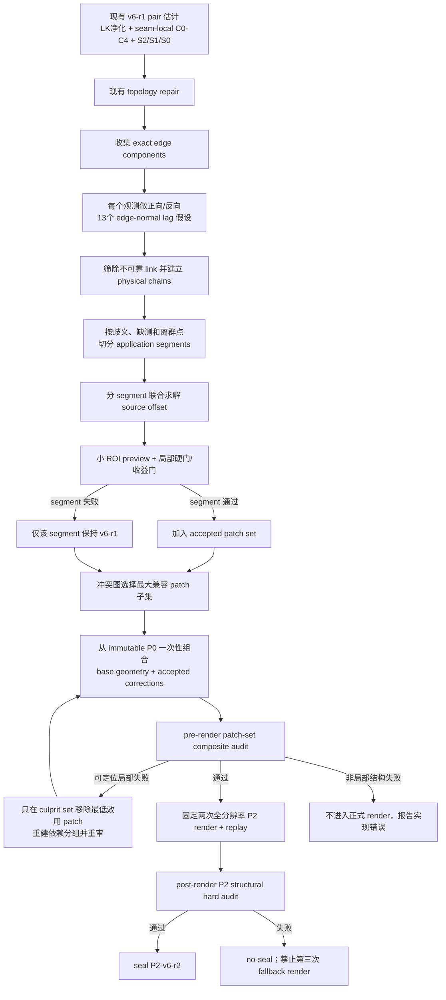

# Panoramic Camera S1.3 M5.1-r4 / seam-v6-r2 渐进式 Component-Chain C2E Codex 实施任务书

> 仓库：`D:\central_strip_Panoramic_Camera`<br>
> 实施分支：`codex/s013-m51-r3-component-local-v6`<br>
> 起始提交：`dd5808ba142646076d7a5ed619a0f3cd6488bb86`<br>
> 候选 family：`S013_output_first_progressive_dense_central_slit_v6`<br>
> 目标实现：`s013_output_first_progressive_dense_central_slit_m51_r4_component_chain_c2e`<br>
> 目标阶段：直接生成并封存 P2-v6-r2；仍不进入 M6/P3<br>
> 性质：研发候选、diagnostic-only、production-ineligible
> 方案修订：2026-08-13 progressive-segment revision；废止“任一失败整链回退”

---

## 0. 给 Codex 的强制执行指令

在当前 seam-v6 分支上直接实现本任务书，不创建 v7，不只做方案评审，也不再停留在“C2E 未尝试”的诊断报告。

必须遵守：

1. 第一条命令运行 `git status --short`，保留所有用户文件和未跟踪 artifact。
2. 不执行 `git reset --hard`、破坏性 checkout、批量删除或 `git add -A`。
3. 使用补丁修改文件；不得覆盖现有真实 generation。
4. 当前 `dd5808ba` 作为 v6-r1 component-local detection baseline，后续直接追加 v6-r2 代码提交。
5. v6-r2 必须真实构造和审计 component-chain C2E map；不得再把“13 个 gate 字段”冒充“13 个位移候选”。
6. C2E 以“可独立审计的 component segment”为最小应用单元；局部门通过且最终成为 conflict/dependency-group winner 的 segment 进入 P2 source UV。失败 segment 单独回退，不能拖累与其独立的 winner segment。
7. 不增加全分辨率 render、GFTT、PyrLK、raw RGB 正式 remap、depth、DIS、Open3D 或 ORB 调用。
8. 不修改全局 candidate manifest、baseline lock 或 production lock。
9. 仍保持 P2-only、`m6_eligible=false`；禁止加载旧 M6 threshold/approval。
10. 测试先行；每个阶段先建立失败测试，再实现。
11. 在真实目标 ROI 达标前，不得声称纸盒斜边已经修复。
12. 最终 P2 允许 `partial`：只要至少一个经过冲突和组合审计的独立 winner segment 安全改善即可应用；未解决区域必须显式记录，不能为了追求全绿而撤销与失败区域无依赖的 winner。

本任务书在下列问题上取代旧的 M5.1-r2 任务书：

- 不再要求另建 v7；
- 不再要求先重跑旧 v5/v6-r1 commit-bound seal；
- 不再禁止 runtime C2E；
- 不再只处理 pair 71；
- 直接解决同一斜边跨多条密集 seam 的累积阶梯。

### 0.1 本轮方案审查已经修正的问题

以下旧设计均不得恢复：

1. **整链全有或全无**：改为 observation 筛选、segment 原子提交、dependency group 组合审计、P2 最终结构审计四层。
2. **强制 pair 68–78 是唯一物理 chain**：改为确定性 chain partition；真实证据允许形成多个 component/segment。
3. **一个 source 只能有一个 correction**：改为 source correction registry，可承载多个互不冲突 segment，并最终解析成单标签 field。
4. **重叠就拒绝“较弱 chain”**：改为有冻结排序和 tie-break 的 conflict graph；保留最大安全收益兼容子集。
5. **`≤1 px`、`≥0.5 px`、`≥30%`、断裂下降 `≥50%` 全部 AND**：改为硬安全门与质量收益门分离，并允许 `improved_unresolved` 安全改善进入 P2。
6. **component mask 外 bit-exact**：修正为 `Ω_map` 外 delta exact、`Ω_out` 外 UV/RGB exact，显式包含 taper 与插值 footprint。
7. **valid 允许只保留 98%**：正式 owner domain 改为 100% valid/support 保留；98% 只用于 evidence sample coverage。
8. **pair-global ambiguity 污染整链**：改为失败 observation/link 只在局部切段。
9. **solver 同时 L2 正则又固定中间 source**：改为加权零均值 gauge，加确定性 robust residual/split。
10. **忽略 normal 坐标系与 reverse 符号**：增加 canonical normal，统一 `abs(forward+reverse)`，所有触发比较使用 `abs(lag)`。
11. **replay-v1 和 pair JSON 重复整个 chain audit**：升级 replay-v2，独立落盘 segment/correction 资产，建立无环 lineage。
12. **候选失败和最终 P2 结构失败混为一谈**：前者在正式渲染前局部 no-op；后者在正式渲染后 no-seal，禁止第三次补渲染。
13. **硬编码 pytest 数量和 5 次运行 P95 门**：改为测试 exit/skip 审查、昂贵调用 exact 计数、paired median 硬门和 P95 报告。

---

## 1. 交付目标

### 1.1 主目标

修复 fast-direct 全景中纸盒斜边跨 pair 68–78 时出现的重复阶梯和断裂，同时保持：

- owner、selected seam、valid mask 和 assignment 拓扑相对 v6-r1 全图 bit-exact；
- 每个有效像素仍只有一个真实 RGB owner；
- 颜色仍来自真实源的一次 inverse sampling；
- C2E 只作用于已验证的同一强边 component chain；
- 正常 pair 继续走 v6-r1 快速路径；
- M5 时间尽量保持当前约 `21–23 s`；
- 正式 P2 全分辨率渲染仍为两次。

### 1.2 成功定义

工程实现完成必须同时满足：

1. 每个 accepted segment 声明确定的 correction influence domain；该域及插值 footprint 之外的像素和 source map 保持 bit-exact，owner、seam 与所有既有非 UV provenance arrays 全图不变；新增 correction field ID 按本任务书单独审计；
2. P2 hard audit、replay、finite/bounds、support、Jacobian 全通过；
3. 四真实分支均停在 P2；
4. 第二轮四分支的 canonical decision payload、PNG、seam、UV、provenance 和 replay 可复现；
5. 全量测试、ruff、compileall 和 diff check 通过；
6. 昂贵性能计数不增加，wall time 不显著回归；
7. 单个 ambiguous、越界或无收益 segment 只局部回退，其他无依赖且最终获胜的安全 segment 仍应用；
8. 输出区分 `complete`、`partial` 和 `none`。

纸盒斜边画质目标 `complete` 还必须满足：

1. fast-direct 目标 ROI 的 edge-step P95 `≤1.0 px`；
2. 最大局部阶梯 `≤1.5 px`；
3. baseline defect union `≥4 px` 时，断裂/double-edge 长度下降 `≥50%`；
4. pair 68–78 组合 ROI 中不产生新的来回弯折；
5. 所有可评估 severe target segments 都达到 `resolved`。

若只满足工程门且至少一个 segment 安全改善，则结果为 `partial`，应实际应用并封存，但不能声称目标完全修复。

### 1.3 非目标

本轮不做：

- M6、P3、photometric calibration 或 blending；
- production lock 或正式 delivery；
- depth、DIS、mesh、Open3D、ORB 重跑；
- 第二次 GFTT/PyrLK；
- 全图 flow、全局单应、全图 graph cut；
- 跨场景通用物体识别；
- 自由逐行 warp、薄板样条或 dense mesh；
- 修改真实 pose、源帧选择或 owner schedule；
- 用模糊、融合或 feather 隐藏残差。

---

## 2. 当前基线与已知事实

### 2.1 v6-r1 已完成的部分

当前 `dd5808ba` 已实现：

- component-local ambiguity；
- pair 71 的 S2/S1/S0 完整复审；
- P2-only v6 identity；
- 两次全分辨率 render；
- 四分支真实 P2 hard audit；
- `1680 passed, 4 skipped` 的完整测试基线。

当前 v6-r1 的最终 PNG、seam、provenance 和 selected geometry 与 v5 相同，这是设计结果，因为 C2E 尚未实现。

### 2.2 当前“13 状态”不是 13 个候选

`src/panorama_demo/video_s13_m51_r3_diagnostic.py` 当前明确：

```text
does not estimate, construct, select, or apply a C2E map
```

现有报告的 `4 pass / 1 fail / 8 unevaluable` 只表示：

- 当前 C0 baseline edge P95 仍超标；
- 部分前置唯一性和方向门通过；
- 改善量、反向一致性、support、Jacobian、位移和 halo 因没有候选而不可评估。

v6-r2 必须真正计算以下 13 个法向位移假设：

```text
-3.0, -2.5, -2.0, -1.5, -1.0, -0.5,
 0.0,
+0.5, +1.0, +1.5, +2.0, +2.5, +3.0 px
```

### 2.3 纸盒斜边不是单 pair 问题

fast-direct 目标区域：

```text
canvas x ≈ 1470…1610
canvas y ≈ 280…350
pair ≈ 68…78
```

当前 component-local 观测显示，纸盒目标区域在相邻 pair 上存在法向 residual 符号交替。下表只是 component matcher 的搜索线索，不是“这些观测已被证明属于同一物理边”的先验标签：

| Pair | 目标区域代表性 lag | 备注 |
|---:|---:|---|
| 68 | `+3.0 px` | actionable |
| 69 | `-2.0 px` | actionable |
| 70 | `-0.5 px` | 已接近安全 |
| 71 | `+1.5 px` / `+3.0 px` | 两个不同 component |
| 72 | `-1.5 px` | actionable |
| 73 | `-1.5 px` | actionable |
| 74 | `≈+0.9 px` | 上斜边接近安全 |
| 75 | `≈-1.2 px` | actionable |
| 76 | `-1.5 px` | actionable |
| 77 | `≈-2.2 px` | actionable |
| 78 | `+0.5 px` | 不应 rescue |

因此不能把 pair 71 单独平移后就结束。必须先建立物理 component chain，再把其中连续、唯一且可审计的观测切成 application segments。每个 segment 联合求解真实源的局部校正量；无法证明同属一条边的观测不得强行连链。

### 2.4 当前 renderer 的重要映射语义

当前正式渲染对 source `i` 使用 pair `i-1` 的 selected alignment map：

```text
source 0: no pair geometry transaction
source i>0: geometry transaction i-1
```

`build_s13_p2_replay()` 在 pair corridor 内同时保存：

- left source map：来自前一 pair 的 alignment；
- right source map：来自当前 pair 的 alignment。

v6-r2 必须让 component-chain correction 在正式 render 和 replay 中使用同一套 source-level map，不能只修改最终 PNG。

---

## 3. 新的运行流程



关键原则：

- seam 和 owner 先保持 v6-r1 结果；
- 先对真实源的 component-local sampling map 做一致校正；
- 不让每条 seam 独立决定一个互相冲突的 warp；
- 不增加第三次全图渲染；
- rejected segment 不再拥有 correction authority；只在其 exclusive domain `Ω_out(rejected) - union(Ω_out(applied))` 保证回到 v6-r1。与 accepted winner 重叠的区域由最终 winner 决定，不能为了恢复 loser 而撤销 winner。
- 最终输出状态为 `complete`、`partial` 或 `none`，而不是一个全局布尔开关。

---

## 4. v6-r2 身份、配置和 schema

### 4.1 保留 v6 family

以下保持不变：

```text
candidate_id: S013_output_first_progressive_dense_central_slit_v6
algorithm_id: S013_output_first_progressive_dense_central_slit_v6
parent_candidate_id: S013_output_first_progressive_dense_central_slit_v5
required_output_components: [s013_p2_v6]
```

### 4.2 必须更新

```text
implementation_id:
  s013_output_first_progressive_dense_central_slit_m51_r4_component_chain_c2e

contract_schema:
  gemini305-video-s13-output-first/v6-r2

P2 completion schema:
  gemini305-video-s13-p2-completion/v6-r2

single pair transaction schema:
  gemini305-video-s13-m5-pair-transaction/v5

aggregate pair transaction manifest schema:
  gemini305-video-s13-m5-pair-transactions/v4

component-chain transaction manifest schema:
  gemini305-video-s13-component-chain-transactions/v1

source-correction manifest schema:
  gemini305-video-s13-source-corrections/v1

source-map oracle manifest schema:
  gemini305-video-s13-source-map-oracles/v1

P2 provenance field-set schema:
  gemini305-video-s13-p2-provenance/v6-r2
```

P2 replay 的 UV/owner 数组布局可以保持，但跨 pair segment/source-map binding 语义已改变，必须升级：

```text
gemini305-video-s13-p2-replay/v2
```

不得用原 `/v1` 只绑定当前 pair transaction 的语义承载跨 pair correction。

### 4.3 配置新增

在 v6 YAML 的 `m51_r4` 下新增并冻结：

```yaml
m51_r4:
  enabled: true
  component_chain_c2e_enabled: true

  minimum_chain_pair_count: 2
  minimum_application_segment_pair_count: 1
  maximum_pair_gap: 1
  split_on_ambiguous_or_unevaluable_observation: true
  split_on_solver_outlier: true
  minimum_component_y_overlap_fraction: 0.50
  maximum_component_normal_difference_degrees: 10.0
  maximum_component_endpoint_distance_px: 8.0
  maximum_predicted_y_disagreement_px: 6.0
  minimum_component_match_margin_fraction: 0.10
  component_match_weights:
    y_overlap: 0.30
    predicted_y: 0.25
    endpoint_distance: 0.20
    correlation: 0.15
    uniqueness: 0.10
  minimum_signed_gradient_agreement: 0.10

  normal_search_minimum_px: -3.0
  normal_search_maximum_px: 3.0
  normal_search_step_px: 0.5
  minimum_c2e_correlation: 0.75
  minimum_c2e_uniqueness_fraction: 0.10
  maximum_forward_reverse_discrepancy_px: 0.5

  source_offset_regularization: 0.05
  maximum_solver_condition_number: 1000000.0
  solver_huber_delta_px: 0.75
  maximum_normalized_solver_residual: 3.0
  maximum_source_normal_offset_px: 3.0
  correction_gain_candidates: [1.0, 0.75, 0.5]

  edge_core_radius_px: 2
  normal_taper_radius_px: 8
  endpoint_taper_px: 12

  maximum_post_edge_p95_px: 1.0
  maximum_post_edge_step_px: 1.5
  minimum_evaluable_edge_columns: 12
  minimum_evaluable_transition_fraction: 0.50
  minimum_resolved_improvement_px: 0.10
  minimum_absolute_improvement_px: 0.5
  minimum_relative_improvement_fraction: 0.30
  minimum_break_length_reduction_fraction: 0.50
  maximum_non_target_p95_regression_px: 0.10
  maximum_non_target_step_regression_px: 0.25
  minimum_formal_owner_support_retention: 1.0
  minimum_evidence_sample_retention: 0.98
  minimum_jacobian: 0.5
  maximum_combined_map_displacement_px: 8.0
  maximum_halo_regression_px: 0.25

  allow_partial_application: true
  maximum_segment_split_depth: 4
  maximum_candidates_per_segment: 3
  maximum_total_roi_candidate_pixels: 1000000
  maximum_exact_conflict_group_nodes: 12
```

配置加载为新的 frozen dataclass：

```python
@dataclass(frozen=True)
class S13M51R4Config(S13M51R3Config):
    ...
```

所有参数必须由 contract validator 做有限性、范围、排序和相互关系检查。

额外要求：component match weights 全部非负且 `abs(sum-1)<=1e-9`；normal search 端点能被 step 整除并恰好产生 13 个状态；hard/quality thresholds 的 strict/non-strict 边界由测试冻结。

这里保留 `minimum_chain_pair_count=2` 用来确认物理 component 身份，但允许一个 application segment 只含一个 pair：前提是该观测已由相邻 component 证据确认身份，且自身正反向、唯一性、视觉和 map 门全部通过。完全孤立、没有 chain context 的单 pair 仍不应用。

### 4.4 manifest 和 lock

只更新：

```text
configs/video_candidates/s013/S013_output_first_progressive_dense_central_slit_v6.yaml
configs/video_candidates/s013/candidate_manifest.json
```

重算 v6 config canonical SHA 和 S013 局部 manifest SHA。

禁止修改：

```text
configs/video_candidates/candidate_manifest.json
configs/video_algorithms/baseline_legacy_fast_b07b561.lock.json
configs/video_algorithms/production.lock.json
旧 v4/v5 config
旧 M6 threshold/approval
```

---

## 5. 核心数据结构

建议新增：

```text
src/panorama_demo/video_s13_m51_r4_component_chain.py
```

### 5.1 组件观测

```python
@dataclass(frozen=True)
class S13EdgeComponentObservation:
    pair_index: int
    component_id: int
    source_indices: tuple[int, int]
    global_bbox_xyxy: tuple[int, int, int, int]
    block_indices: tuple[int, ...]
    normal_x: float
    normal_y: float
    fitted_line_offset: float
    forward_best_lag_px: float
    reverse_best_lag_px: float
    correlation: float
    uniqueness_fraction: float
    orientation_difference_degrees: float
    mask_sha256: str
    evidence_state: Literal["actionable", "safe_anchor", "ambiguous", "unevaluable"]
    exclusion_reasons: tuple[str, ...]
```

内部必须保留 exact component mask 或等价 deterministic support coordinates；transaction 只需保存 bbox、统计和 mask SHA，避免 JSON 过大。

在任何匹配或切段前，从原始 observations 冻结通用的 `baseline_c2e_obligations`：

```python
@dataclass(frozen=True)
class S13BaselineC2EObligation:
    obligation_id: str
    pair_index: int
    component_id: int
    global_bbox_xyxy: tuple[int, int, int, int]
    support_sha256: str
    baseline_metrics: Mapping[str, object]
    severe: bool
    evaluable: bool
    scope: Literal["runtime_detected"]
```

它是 runtime `repair_complete` 的固定分母，后续 ambiguity、split、conflict、budget deferred 或 reject 都不能删除 obligation。正式算法不得硬编码纸盒 ROI、pair 68–78 或 component ID；这些只属于外部真实验收报告。

### 5.2 组件链

```python
@dataclass(frozen=True)
class S13EdgeComponentChain:
    chain_id: str
    pair_indices: tuple[int, ...]
    source_indices: tuple[int, ...]
    observations: tuple[S13EdgeComponentObservation, ...]
    canonical_normal_xy: tuple[float, float]
    global_bbox_xyxy: tuple[int, int, int, int]
    chain_sha256: str
```

chain 是证据和物理身份容器，不再是原子提交单元。ambiguous/unevaluable observation 可以保留在 chain 报告中作为断点，但不能进入求解。

### 5.3 应用分段

```python
@dataclass(frozen=True)
class S13ComponentApplicationSegment:
    segment_id: str
    parent_chain_id: str
    pair_indices: tuple[int, ...]
    source_indices: tuple[int, ...]
    observations: tuple[S13EdgeComponentObservation, ...]
    left_cut_reason: str | None
    right_cut_reason: str | None
    global_bbox_xyxy: tuple[int, int, int, int]
    segment_sha256: str
```

segment 是最小求解、预览、接受和回退单元。chain 中遇到 ambiguity、缺测、求解离群点或局部画质失败时，应在确定位置切段并继续评估其余部分。

### 5.4 每源校正

```python
@dataclass(frozen=True)
class S13SourceComponentCorrection:
    segment_id: str
    source_index: int
    frame_id: int
    x0: int
    x1: int
    y0: int
    y1: int
    delta_u: np.ndarray
    delta_v: np.ndarray
    weight: np.ndarray
    correction_sha256: str
```

一个 source 可以拥有多个互不冲突的 segment correction。编排接口必须使用：

```python
Mapping[int, tuple[S13SourceComponentCorrection, ...]]
```

不得再假定每个 source 最多只有一条 correction。

### 5.5 分段候选与最终 patch set

```python
@dataclass(frozen=True)
class S13ComponentSegmentCandidate:
    segment: S13ComponentApplicationSegment
    source_offsets_px: tuple[float, ...]
    gain: float
    corrections: tuple[S13SourceComponentCorrection, ...]
    decision: Literal[
        "resolved",
        "improved_unresolved",
        "rejected",
        "budget_deferred",
    ]
    rejection_reasons: tuple[str, ...]
    audit: Mapping[str, object]

@dataclass(frozen=True)
class S13ComponentPatchSet:
    accepted_segment_ids: tuple[str, ...]
    rejected_segment_ids: tuple[str, ...]
    deferred_segment_ids: tuple[str, ...]
    application_state: Literal["complete", "partial", "none"]
    corrections_by_source: Mapping[
        int, tuple[S13SourceComponentCorrection, ...]
    ]
    unresolved_regions: tuple[Mapping[str, object], ...]
    audit: Mapping[str, object]
```

所有 ndarray 必须不可由调用方原地修改；创建后设置只读或在边界复制。

---

## 6. T0：冻结当前 v6-r1 对照

不需要先重跑旧 v5/v6 seal，但实现前必须记录：

- 当前 HEAD `dd5808ba142646076d7a5ed619a0f3cd6488bb86`；
- 当前 v6 config SHA `f490b9b183754954ba5cccc609940e3851603a747062ed8add39e5e2841bdbb4`；
- 当前四分支 P2 completion SHA；
- 当前 fast-direct PNG、seam、provenance、pair 68–78 transaction SHA；
- 当前目标 ROI 图和 edge trace；
- 当前 M5 wall time 和性能计数。

这些只作为 v6-r1 rollback oracle。不要复制完整 generation 进新 Git 提交。

新增回归：当 `component_chain_c2e_enabled=false` 或所有 segment candidate 被拒绝时，v6-r2 的 PNG、seam、旧 provenance 数组、`source_u/v` 和 replay map arrays 必须与该 oracle 完全一致。新 v6-r2 identity、schema、audit、transaction 和 correction sentinel 字段按新契约生成，不要求与 v6-r1 文件字节相同。

---

## 7. T1：输出可跟踪的 exact component 证据

修改：

```text
src/panorama_demo/video_s13_quality.py
```

当前 component audit 主要保存 bbox 和聚合统计。v6-r2 还需要在运行时返回：

- exact component mask 或 deterministic support coordinates；
- 拟合直线参数；
- signed gradient polarity；
- 上下或左右端点；
- 在 seam 位置预测的交点；
- mask SHA；
- 每个 block 的 13 个 forward score；
- 每个 block 的 13 个 reverse score。

不得把这些大数组全部写进 transaction JSON；只在内存中传给 chain builder，JSON 保存摘要和 SHA。

### 7.1 直线拟合

对强边 component 的支持点做加权正交直线拟合：

```text
n_x × x + n_y × y = c
```

权重使用梯度 magnitude。法向统一符号，使 signed gradient polarity 可比较。

### 7.2 正反向 13 假设

对每个 lag：

```python
lags = np.arange(-3.0, 3.0 + 0.25, 0.5)
```

分别计算：

- magnitude correlation；
- signed orientation agreement；
- support count；
- combined score；
- best/second uniqueness。

反向搜索不是 backward PyrLK，只是把 right component 的 Sobel ROI 沿反法向采样 left features，计算量很小。

正反向符号必须明确：若 forward best lag 为 `d_f`，reverse best lag 为 `d_r`，一致性定义为：

```text
abs(d_f + d_r) <= 0.5 px
```

若最优值落在 `-3` 或 `+3 px` 搜索边界，必须记录 `search_boundary_hit=true`。它不自动拖累其他观测；该观测只有在实际 rendered candidate 仍满足局部硬安全门且产生可验证改善时才能作为 `improved_unresolved`，不能因边界分数而标为 `resolved`。

### 7.3 单观测接受门

一个观测可进入可求解 segment 必须满足：

```text
component_ambiguous = false
correlation >= 0.75
uniqueness >= 0.10
orientation difference <= 10 degrees
forward/reverse discrepancy <= 0.5 px
finite support
```

`abs(lag) ≤1 px` 的观测可以进入 chain 作为 `safe_anchor`，但不单独触发 rescue；只有 chain 内至少存在一个 `abs(lag) >1 px` 观测才尝试 C2E。

单个观测失败时只把该观测标为 `ambiguous` 或 `unevaluable` 并形成 segment cut；不得把 pair-global ambiguity 粘滞到整条 chain，也不得因此放弃 chain 另一侧的唯一观测。

### 7.4 冻结 obligation universe

component transaction manifest 必须在切段前写入全部 `baseline_c2e_obligations[]`，并为每次 chain/split 记录：

- parent obligation/segment → child segments；
- covered、resolved、improved、unresolved、rejected、deferred 的列/像素数量；
- 未覆盖原因；
- 每个 obligation 最终由哪些 applied segment 负责。

runtime `repair_complete=true` 只能针对这份原始 obligation universe 计算：所有 frozen `severe && evaluable` obligation 都必须被 applied `resolved` segment 覆盖。禁止通过递归切掉失败核心、降低 coverage 或把它改成 unevaluable 来“洗成 complete”。

真实验收脚本在算法外部声明纸盒 ROI，并按原始 obligation bbox/support 与 ROI 的相交关系冻结 `box_target_obligation_ids`，另计算 `box_target_repair_complete`。它不能反向改变 runtime detection、切段、选择或 P2 像素。

---

## 8. T2：跨 pair 建立同一物理 component chain

新增纯函数：

```python
build_s13_edge_component_chains(
    pair_observations,
    *,
    config: S13M51R4Config,
) -> tuple[S13EdgeComponentChain, ...]
```

### 8.1 坐标统一

所有 bbox、端点和拟合线必须先转换到 canvas global 坐标。禁止直接比较不同 pair crop 的 local x。

`y overlap fraction` 明确定义为：

```text
intersection_length / min(left_y_length, right_y_length)
```

`maximum_pair_gap=1` 表示 pair index delta 必须恰为 1；不是“允许漏掉一个 pair”。缺失一个 pair 就切段，不跨缺口连接。

### 8.2 相邻匹配

两个相邻 pair component 可连接，当且仅当：

1. pair index 差不超过 `maximum_pair_gap`；
2. y 区间重叠率 `≥0.50`；
3. 法向角差 `≤10°`；
4. 相邻端点距离 `≤8 px`；
5. 将两条拟合线外推到两 seam 中点时，预测 y 差 `≤6 px`；
6. signed gradient polarity 一致；
7. 两者均不是 ambiguous；
8. 不与另一条同强度 component 产生等价匹配。

对通过硬兼容门的候选边，用 YAML 中冻结权重将 y-overlap、外推 y 差、endpoint distance、corr/uniqueness 构成 `[0,1]` 分数，在相邻 pair 间做小型 deterministic maximum-weight one-to-one matching。距离项按 `1-distance/maximum` clamp 到 `[0,1]`，其余项也显式 clamp。best-vs-second margin `<10%` 时该 junction 标为 ambiguous。出现一对多或多对一且无法唯一消歧时，只在该观测位置切断；已唯一匹配的前后 segment 继续评估。

在冻结这些阈值前，必须从现有 fast-direct pair 68–78 transaction 生成 match matrix 报告，列出所有候选的各子分数、winner 和 margin。阈值可以根据该证据在 v6 YAML 中修订，但禁止在代码中硬编码或为强行形成一条长链而放宽 polarity/物理身份门。

### 8.3 不合并 component 8 与 9

pair 71 当前至少包含：

- component 8：约 `y=288…302`、lag `1.5 px`；
- component 9：约 `y=322…337`、lag `3.0 px`。

它们必须因为 y 区域、端点和拟合线不同而形成不同 chain。禁止使用 pair aggregate P95 代替 chain-specific P95。

### 8.4 chain 触发条件

默认只处理：

```text
连续观测 pair 数 >= 2
至少一个 component abs(lag) > 1 px
至少一个 chain 覆盖真实 selected seam
```

实现必须是通用的，但真实验收重点是 pair 68–78 的纸盒 chain。

### 8.5 确定性切段

新增纯函数：

```python
split_s13_edge_component_chain(
    chain,
    *,
    config: S13M51R4Config,
) -> tuple[S13ComponentApplicationSegment, ...]
```

初始切点包括：

- component 身份一对多或多对一；
- observation ambiguous/unevaluable；
- component 8/9 等物理边切换；
- pair gap；
- polarity 或法向突变；
- search support 中断。

后续若求解或 rendered preview 只在某个 seam 失败，对每个可定位 pair/edge 构造确定性 `split_key`：

```text
(
  hard_violation_count,
  maximum_normalized_gate_excess,
  normalized_solver_residual,
  baseline_edge_excess_px,
  -pair_index,
)
```

取词典序最大的 edge 为切点。上限门的 normalized excess 为 `max(0, value-limit)/max(abs(limit),1e-6)`，下限门为 `max(0, limit-value)/max(abs(limit),1e-6)`；不可评估但必须通过的硬门计为一个 hard violation。最后以较小 pair index 决胜。递归评估左右子段，直到：

- 子段通过；或
- 已降为单 pair segment 仍失败。

切段深度受 `maximum_segment_split_depth` 限制。切段必须确定性，不能根据线程完成顺序变化。

---

## 9. T3：联合求解真实 source 的法向偏移

新增：

```python
solve_s13_component_segment_source_offsets(
    segment: S13ComponentApplicationSegment,
    *,
    config: S13M51R4Config,
) -> Mapping[int, float]
```

### 9.1 约束方程

对 pair `i` 的 accepted observation：

```text
z_(i+1) - z_i = -lag_i
```

这里的符号必须由合成 inverse-map 单测验证，不能凭直觉写死。

权重：

```text
w_i = correlation_i
      × clamp(uniqueness_i / 0.10, 0, 2)
      × support_confidence_i
```

其中：

```text
support_confidence_i = clamp(
    min(forward_valid_samples_i, reverse_valid_samples_i)
    / max(reference_support_samples_i, 1),
    0,
    1,
)
```

三个 sample count 都必须来自同一 exact component support 和同一 13-state sampling footprint，并写入 segment audit。

### 9.2 目标函数

```text
minimize
  Σ w_i × (z_(i+1) - z_i + lag_i)^2
  + λ × Σ (z_(i+1) - 2z_i + z_(i-1))^2
```

其中 `λ=0.05`，只抑制 source offset 的二阶振荡，不承担 gauge。不要再加 `Σz²`，也不要任意固定 chain 中间 source；使用各 source 在该 segment 中的有效 owner-support 作为权重，施加唯一的确定性加权零均值 gauge：

```text
Σ a_s × z_s = 0
```

`a_s` 定义为 v6-r1 中 source `s` 在该 segment source-specific `Ω_out` 内的 valid owner pixel count，所有 `a_s` 再归一化使总和为 1；若总和为 0，该 segment unevaluable。这样优先最小化实际受影响像素的总移动，避免仅因 source 序号改变结果。

残差项使用 `solver_huber_delta_px=0.75` 的 Huber loss，固定执行 3 轮 deterministic IRLS；初始 robust multiplier 为 1，后续为 `min(1, delta/max(abs(r_i),1e-6))`。每轮都按 pair index 固定行顺序构建设计矩阵。最终：

```text
sigma = max(normal_search_step_px, 1.4826 * MAD(final_residuals))
normalized_solver_residual_i = abs(final_residual_i) / sigma
```

condition number 对包含零均值 gauge row 和二阶正则 row 的最终 float64 augmented matrix 计算。若某观测最终成为唯一最大离群点，在该观测处按第 8.5 节切段并分别重解；不能直接丢弃整条 chain。

可用小型 `numpy.linalg.lstsq`；变量通常不超过十几个，复杂度可忽略。

### 9.3 约束、降级和切段

求解后必须满足：

```text
所有 offset finite
|z_i| <= 3 px
相邻 offset 差 <= 3 px
IRLS 后 normalized residual <= 3.0
解的条件数 finite 且 <= 1,000,000
```

若 unconstrained 解越界，不要直接 clip 后宣称有效。对当前 segment 按以下顺序尝试：

```text
gain 1.0 -> 0.75 -> 0.5
```

canonical unscaled solution 只求解一次；gain 只缩放该解，不得为每个 gain 重新拟合 observation，以保证候选可比较和复现。

每个 gain 都必须重新走完整视觉和 map 审计。全部失败时：

1. 若失败集中在一个内部 seam，在该 seam 切段，递归评估左右子段；
2. 若失败来自 segment 端点，在失败端收缩一个 observation 后重评；
3. 单 pair segment 仍失败时，只拒绝该 segment。

禁止因一个 segment 求解失败清空其他 segment 的 correction。

---

## 10. T4：从 immutable P0 构造 component-local map

### 10.1 权重场

对每个 source 的 component mask 构造 deterministic float32 权重：

- edge core 半径 `2 px` 内为 1；
- 沿法向距离在 `2…8 px` 平滑降为 0；
- component 两端各 `12 px` 平滑归零；
- 声明的 correction support `Ω_map` 外严格为 0；
- invalid、边界、ambiguous 或 competing-layer 区域强制为 0。

建议使用固定余弦或 smoothstep taper，不允许数据相关的自由平滑。

同一 source 可能由左右两个 incident pair 提供 component support。必须先把两侧 support 转到该 source 的统一 canvas/target 域，验证线位置、polarity 和局部 normal 相容，再构造一个 source-specific track。不能把两个 pair comparison mask 直接相加或任选一侧；不相容时在该 source 处切段并对两侧重新求解。

必须区分三个域，避免把不可实现的“component 外所有像素 bit-exact”写成门禁：

```text
Ω_core = exact edge component mask
Ω_map  = Ω_core 经 normal/endpoint taper 扩展后 weight > 0 的 map 域
Ω_out  = 正式 owner 像素中，其 inverse-sampling footprint 与 Ω_map 相交的输出域
```

要求是：delta 在 `Ω_map` 外 bit-exact 等于 v6-r1；source UV 和 RGB 在 `Ω_out` 外 bit-exact；owner、seam、valid 和所有既有非 UV provenance arrays 全图 bit-exact。新增 correction field ID 仅在实际 applied `Ω_out` 写非负值，其余为 `-1`。`Ω_out` 必须包含插值核半径，不能把 taper 或 bilinear footprint 误报成泄漏。

对法向变化不大的斜边，segment 先计算确定性的 canonical normal。每个 observation lag 投影到该 canonical normal 后进入求解；实际 correction 使用由相邻拟合线插值得到的局部 normal field，并验证它与 canonical normal 的夹角始终不超过配置上限，避免把弯曲斜边当作一个固定全图方向。

### 10.2 delta 组合

```python
component_delta_u = weight * source_offset * normal_x
component_delta_v = weight * source_offset * normal_y

combined_delta_u = base_candidate_delta_u + component_delta_u
combined_delta_v = base_candidate_delta_v + component_delta_v
```

之后只做一次 inverse map 构造和一次 raw RGB sampling。

禁止：

- 对已经 remap 的图再 remap；
- 修改 P0；
- 在整高 corridor 使用统一 `(du,dv)`；
- `Ω_map` 外泄漏非零 delta；
- 多个重叠 segment correction 直接相加。

多个 segment 的组合规则：

1. support 不相交：全部保留；
2. 同一 parent chain 的相邻 segment 若只因 endpoint taper 发生重叠，在 canonical cut midpoint 对两侧 support 截断并各自 taper 到 0，然后重新局部审计；
3. 其他任何 `Ω_map` 重叠都进入 conflict graph，只选择一个 winner；首版不对重叠 vector 做求和、平均或 composite merge；
4. 若冲突只发生在 segment 端部，可在新的 weight=0 切点重评非冲突子段；
5. 最终 registry 中每个 source 像素最多一个 segment correction，合成代数唯一为 `base_delta + winner_delta`。

冲突优先级采用冻结的词典序，不使用难以校准的任意加权总分：

```text
rescued severe seam count（降序）
worst-seam absolute improvement（降序）
supported unique edge columns（降序）
post maximum step（升序）
correction energy（升序）
segment_id（升序）
```

小型 conflict group 可枚举所有兼容子集，再按上述“集合聚合键”选择；超过冻结节点上限时用同一顺序的 deterministic greedy。winner 仍必须重新走 dependency-group composite audit。完全相同效用按 segment ID tuple 排序，保证复现。

### 10.3 新的 `_map_crop` 接口

修改：

```python
_map_crop(
    ...,
    candidate: S13AlignmentCandidate | None,
    component_corrections: tuple[S13SourceComponentCorrection, ...] = (),
)
```

它必须先按已审计的 conflict/merge 决策，在 target/canvas delta 域组合 base geometry 和多个 segment correction，再经过现有 undistortion inverse map。

---

## 11. T5：插入 M5 主流程

主插点：

```text
现有 pair 估计
-> topology repair
-> 新 component-chain rescue
-> geometry render
-> final seam render
-> replay
-> hard audit
```

对应代码位置：`video_s13_m5.py` topology repair 返回之后、`render_s13_p2_from_raw()` 调用之前。

当前 pair estimator 的 raw/feature cache 是函数局部变量，不能在它返回后凭空“复用”。先把返回边界升级为：

```python
@dataclass(frozen=True)
class S13M5EstimationResult:
    pairs: tuple[S13M5Pair, ...]
    evidence_context: S13M51R4EvidenceContext
```

`evidence_context` 只持有本轮已解码 raw-image cache、crop features、exact observations 和 deterministic masks 的只读引用。component rescue 在同一次 `estimate_s13_m5_transactions()` 内、topology repair 之后运行；正式 render 前只把冻结的 registry 交给外层。不得因错误的函数边界重新 decode raw frame 或重建全图 Sobel。

新增编排函数：

```python
estimate_s13_component_chain_corrections(
    schedule,
    calibration,
    vertical,
    pairs,
    evidence_context,
    config,
) -> tuple[
    S13ComponentPatchSet,
    Mapping[str, object],
]
```

### 11.1 快速路径

满足以下任一情况时直接返回空 patch set：

- v6-r2 功能关闭；
- 没有 actionable component；
- 没有 `abs(lag)>1 px` residual；
- 没有可唯一跟踪的 chain；
- chain 少于两个 pair；
- 所有 observation 的 reverse audit 都不通过。

正常 pair 不做任何额外 ROI remap。

单个 observation 的 reverse audit 失败只形成切点；其他 segment 继续。函数只有在没有任何可应用 segment 时返回 `application_state=none`。

### 11.2 候选 ROI

每个当前 segment 只构建：

- baseline ROI；
- gain `1.0` candidate；
- 必要时 gain `0.75`；
- 必要时 gain `0.5`。

ROI 为 segment bbox 加固定 halo，不得渲染全图。失败 segment 按确定性规则切分后，只对子段的更小 ROI 重评；已经通过的 segment 不重复采样。

### 11.3 seam 行为

第一版保持 v6-r1 selected seams 不变。原因：当前 S2/S1/S0 已完整评估，三者主要问题是源间 geometry residual，不是 seam 路径缺失。

C2E 接受后，可以在 transaction 中重新计算三条既有 seam 的局部指标用于报告，但不得重新运行 DP，也不得为了接受 C2E 改变 owner topology。

这使 v6-r2 的正式像素变化只来自 source UV，不来自 owner 变化，便于验证和回退。

---

## 12. T6：候选视觉与几何接受门

### 12.1 component-specific 指标

每个 segment 独立计算：

- baseline edge P50/P95/max；
- candidate edge P50/P95/max；
- absolute/relative improvement；
- forward/reverse discrepancy；
- correlation 和 uniqueness；
- break length；
- double-edge length；
- component 两端 halo regression；
- formal owner-domain valid retention 与 evidence-sample coverage（分别记录，前者必须 1.0）；
- combined delta 和 source-map Jacobian。

禁止再从整个 pair 的所有 components 聚合一个 P95 后作为 C2E gate。

### 12.2 segment 与最终 patch set 连续性

先在每个 segment ROI，再在 accepted patch set 的 composite owner-only ROI 中提取强边轨迹：

```text
y_edge(x)
```

仅在有唯一强边支持的列评估。记录：

- 每条 seam 左右的 edge step；
- step P50/P95/max；
- 一阶斜率突变；
- 二阶差分 P95；
- 缺失列/断裂长度；
- double-edge 列数；
- component 被 owner seam 穿越次数。

### 12.3 不可放宽的局部硬安全门

每个 segment candidate 必须全部满足：

```text
forward/reverse discrepancy <= 0.5 px
minimum correlation >= 0.75
minimum uniqueness >= 10%
maximum orientation difference <= 10 degrees
formal owner-domain map support retention = 1.0
minimum Jacobian >= 0.5
maximum component offset <= 3 px
maximum combined map displacement <= 8 px
halo regression <= 0.25 px
horizontal catastrophe guard passes
all affected source maps finite and in bounds
delta outside Ω_map is bit-exact
source UV/RGB outside Ω_out is bit-exact
segment boundary has no new edge step or curvature spike
owner/seam/valid/existing non-UV provenance arrays unchanged
```

Jacobian 必须在最终 `target/canvas -> raw source` inverse map 上计算，不是只审 component delta；同时记录相对 v6-r1 的 minimum-Jacobian ratio，禁止 correction 把原本安全区域推向折叠边界。

formal owner support 的分母是 v6-r1 valid owner pixels，要求 100% 保留且不能新增 valid。evidence-sample retention 的分母是 `declared correction support ∩ owner domain` 中原本可评估的样本，要求 `≥0.98`；不得用整幅 source 面积稀释小 ROI 的样本损失。

这些是安全门，不以全图平均值替代，也不能通过其他 segment 的好结果抵消。

### 12.4 质量收益分级

通过硬安全门后，不再要求“`≤1 px`、绝对改善 `≥0.5 px`、相对改善 `≥30%`”三项同时成立，因为这会错误拒绝从 `1.2 px` 改到 `0.9 px` 的有效结果。

先按 baseline observation 分层：

```text
rescue observation: baseline P95 > 1.0 px
guard observation:  baseline P95 <= 1.0 px
```

guard 不承担改善指标，只要求 candidate P95 `≤max(1.0, baseline+0.25)`、maximum step 增量 `≤0.25 px` 且 break/double-edge 不增加。任何 guard 退化都必须切段或拒绝当前 segment，不能被 rescue observation 的平均改善掩盖。

按以下互斥规则判定：

#### `resolved`

```text
candidate edge P95 <= 1.0 px
candidate maximum local step <= 1.5 px
break/double-edge union 不增加
且相对 baseline 至少改善 0.10 px，或 baseline 的 break/double-edge 明确减少
```

#### `improved_unresolved`

```text
candidate P95 < baseline P95
且满足：absolute improvement >= 0.5 px
        或 relative improvement >= 30%
        或 break/double-edge length reduction >= 50%
candidate maximum step 不得比 baseline 增加 > 0.25 px
非目标 P95 不得增加 > 0.10 px
break/double-edge union 不得增加
```

`improved_unresolved` 允许进入 P2，因为它是已证明安全的实质改善，但必须保留 unresolved 标记，不能声称已经达到 `≤1 px` 目标。

break/double-edge 使用两者 union 后的像素长度。baseline `≥4 px` 时才计算“下降 50%”，并要求 candidate `≤floor(0.5×baseline)`；baseline 为 `1…3 px` 时只要求不增加，baseline 为 0 时要求 candidate 仍为 0。样本 coverage 不足时标为 `not_applicable` 并要求其他可评估指标不回归；不得把 unevaluable 伪装成 pass，也不得仅因无法计算比例而拒绝候选。

#### `rejected`

以下任一成立时只拒绝当前 segment：

- 硬安全门失败；
- 无可测量改善；
- candidate 使最大阶梯、断裂、双边、halo 或非目标结构超过退化容差；
- 单 pair 子段仍无法通过。

### 12.5 gain 与 segment 选择规则

对同一 segment 的候选采用词典序选择：

1. `resolved` 优于 `improved_unresolved`；
2. 先最小化最坏 seam step，再最小化 P95 和断裂长度；
3. 指标差值 `≤0.15 px` 时选择较小 gain；
4. 再相同时选择总位移较小者；
5. 不得用全图平均分掩盖某一 seam 失败。

segment 失败时按第 8.5 节递归切段。最终对所有通过的 segment 建 conflict graph，选择总安全收益最大的兼容 patch 子集。

### 12.6 渐进式应用与局部回退

输出不是全局 `accepted: bool`，而是：

```text
complete = 切段前冻结的全部 runtime severe/evaluable obligations 均被 resolved
partial  = 至少一个 segment 已安全改善，仍存在 rejected 或 unresolved 区域
none     = 没有 segment 可安全应用，P2 像素与既有 map arrays 等于 v6-r1
```

局部回退层级：

1. observation 失败：排除该 observation，并在此切段；
2. segment 失败：只清空该 segment correction；
3. correction 冲突：保留最大效用兼容子集，拒绝冲突节点，不影响无冲突节点；
4. composite audit 可定位到 patch：移除相关 patch 中效用最低者并重新组合；
5. 最终全局 hard audit 出现无法定位的 provenance/replay/schema 错误：不得 seal P2，必须报告实现错误，不能用一次全局静默回退掩盖它。

因此，一个 segment 不得仅因同 chain 的另一独立 segment、另一 component 或另一 pair 失败而撤销；但 conflict loser 或 dependency-group composite audit 的已定位 culprit 可以被移除。

最终唯一的全局 exact 门是：`union(Ω_map(applied))` 外 delta 与 v6-r1 exact，`union(Ω_out(applied))` 外 SourceMapOracle UV/valid 与 v6-r1 exact。rejected segment 与 winner 重叠的区域不属于 rejected-exclusive baseline 域。

---

## 13. T7：transaction、replay 和 provenance

### 13.1 独立 segment audit 资产

不要把整条 chain 的大 audit 复制到每个 pair JSON。新增：

```text
P2/component_chain_transactions/manifest.json
P2/component_chain_transactions/segment_<id>.json
P2/component_chain_transactions/segment_<id>.npz
P2/source_corrections/manifest.json
P2/source_corrections/source_<index>.npz
P2/source_maps/manifest.json
P2/source_maps/source_<index>.npz
```

每个 segment JSON 保存：

- parent chain、pair/source/component IDs；
- observation 状态和切段原因；
- 13 个 forward/reverse hypothesis 摘要；
- 求解 offset、gain、quality state；
- 影响闭包 pair 集合；
- hard/quality gate；
- conflict group、winner/loser 和理由；
- `resolved | improved_unresolved | rejected | split`；
- NPZ/config SHA 和不含动态 lineage 字段的 `decision_payload_stable_sha256`。

segment JSON 不得包含自身最终 SHA。外层 component transaction manifest 计算并保存每个 segment JSON SHA 和 NPZ SHA。

segment NPZ 至少保存可重验的 compact support/weight/delta 或 deterministic support coordinates。只在 JSON 中记录一个无法重建的 mask SHA 不足以封存证据。

component transaction manifest 保存：

- 切段前 `baseline_c2e_obligations[]`；
- deterministic chain partition 和 parent→child split graph；
- 所有 segment JSON/NPZ SHA；
- applied/rejected/deferred decisions 与 obligation coverage；
- stable decision payload SHA；
- 不包含任何下游 pair/replay/completion SHA。

source correction manifest 按 source 绑定：

- parent component transaction manifest SHA；
- contributors；
- 单标签 resolved field；
- `Ω_map` / `Ω_out` 摘要；
- combined correction SHA；
- final SourceMapOracle SHA。
- canonical field-ID table 和每个 field 的 segment transaction/support/correction asset SHA。

source-map oracle manifest 绑定 parent source correction manifest SHA、每个 source 的 canonical domain/header/NPZ SHA 及 base/final oracle SHA。

### 13.2 pair transaction v5

pair transaction 只保存局部引用，不重复整条 audit：

```json
{
  "component_chain_c2e": {
    "schema": "gemini305-video-s13-component-chain-c2e-pair-ref/v1",
    "application_state": "partial",
    "component_transaction_manifest_sha256": "...",
    "source_correction_manifest_sha256": "...",
    "source_map_oracle_manifest_sha256": "...",
    "left_source_map_oracle_sha256": "...",
    "right_source_map_oracle_sha256": "...",
    "left_source_map_slice_sha256": "...",
    "right_source_map_slice_sha256": "...",
    "refs": [
      {
        "segment_id": "...",
        "segment_transaction_sha256": "...",
        "local_component_id": 8,
        "role": "rescued",
        "state": "resolved",
        "affected_source_indices": [71, 72]
      },
      {
        "segment_id": "...",
        "segment_transaction_sha256": "...",
        "local_component_id": null,
        "role": "closure_only",
        "state": "resolved",
        "affected_source_indices": [71, 72]
      }
    ]
  }
}
```

未触发 pair 写 `application_state=none` 和 `reason=no_actionable_component_segment`。aggregate pair manifest v4 必须绑定 component transaction、source correction 和 source-map oracle 三个 manifest SHA。

受 corrected source 影响但没有本地 component 的 closure-only pair 也必须写 ref；此时 `local_component_id=null`。aggregate pair manifest v4 还必须绑定所有 pair transaction SHA，不能只依赖通用 stage asset 列表。

`role` 枚举为 `rescued | guard | closure_only | cut | unaffected`；`state` 枚举为 `resolved | improved_unresolved | rejected | split | budget_deferred | not_applicable`。

### 13.3 transaction SHA 与 canonical payload

浮点在写盘/hash 边界沿用现有 canonical 6 位规则；内部求解使用完整精度。canonical payload 必须覆盖所有会改变选择的输入、切分、冲突、offset、map 和审计决定；不得把时间、generation path 等动态字段混入决策 hash。

“没有 accepted segment 时 byte-exact v6-r1”仅指：PNG、seam、旧 provenance 数组、`source_u/v` 和 replay UV/valid/owner 数组。v6-r2 的 identity、schema、新 audit、新 sentinel correction-ID 数组和 transaction SHA 本来就会不同，不能要求整个目录 byte-identical。

### 13.4 统一 map provider

topology repair 之后、两次正式 render 之前冻结：

```python
SourceCorrectionRegistry[source_index]
```

每个 source 保存已经 conflict-resolved 的非重叠合成 correction 和 contributor IDs。geometry render、final render 和 replay 必须统一调用：

```python
map_provider(source_index, x0, x1)
```

该 provider 唯一负责：

```text
base candidate delta
+ resolved component delta
-> undistortion inverse map
```

禁止三处分别重建 map。

定义唯一的 `SourceMapOracle`，作为 formal render、replay 和 hash verifier 的共同 authority：

```text
D_s = source s 在以下区域的 canvas-domain union bbox：
      v6-r1 formal owner support
      ∪ 所有涉及 s 的 replay left/right corridor
      ∪ accepted Ω_out
      ∪ 固定插值核 halo
```

对每个 source 在 `D_s` 一次生成：

```text
source_index: int32
domain_xyxy: int32[4]
u: little-endian float32[height,width]
v: little-endian float32[height,width]
valid: uint8[height,width]
field_id: little-endian int32[height,width]
```

数组固定 C-order/row-major。invalid 位置的 `u/v` canonical 为 `0.0`，清除 `-0.0`，禁止用 NaN payload 参与 hash。SHA 覆盖 schema、source index、domain、shape、dtype 和上述数组字节。formal owner pixels 与 replay slices 都必须逐元素来自同一 oracle；replay 可以另写 slice SHA，但必须记录 parent oracle SHA 和 canonical slice bbox。

运行时不额外渲染 v6-r1 RGB 来证明 `Ω_out` 外 RGB exact。registry freeze 前同时生成无 RGB sampling 的 v6-r1 base-map oracle；证明 `Ω_map` 外 delta=0、`Ω_out` 外 base/final oracle UV/valid exact、raw source文件 SHA 相同，即可推导 RGB 相同。完整 PNG byte-exact 只在合成回归和真实两轮 seal 中比较。

### 13.5 replay v2

binding 语义和 correction authority 都已改变，因此 replay 必须升级为：

```text
gemini305-video-s13-p2-replay/v2
```

每个 pair entry 除原绑定外，还要绑定：

- component transaction manifest SHA；
- source correction manifest SHA；
- left/right parent SourceMapOracle SHA 和 slice SHA；
- relevant segment transaction SHA 列表；
- own seam/base geometry transaction SHA。

replay root manifest 还必须直接绑定 aggregate pair transaction manifest SHA、component transaction manifest SHA、source correction manifest SHA 和 source-map oracle manifest SHA；不能只依赖 entry 的间接引用。

每个 pair replay NPZ 新增：

```text
left_component_correction_field_id: int32
right_component_correction_field_id: int32
```

loader 必须逐元素验证这些 label 与 parent source oracle、source correction asset 和 relevant field/segment table 一致；正式 owner 像素上的 label 还必须与 panorama provenance 的 correction field ID 一致。这样 replay 的非 owner side 也能独立复验 correction authority。

`build_s13_p2_replay()` 必须使用冻结 registry 和同一个 `map_provider`，left/right `source_u/v`、valid 和 field ID 与 SourceMapOracle slice 完全相同。

### 13.6 provenance

保持 bit-exact：

- owner frame/source index；
- assignment index、valid 和 seam transaction ID；
- source `i>0` 的 base geometry transaction ID 仍为 `i-1`；
- secondary owner、secondary UV、weight 仍为 sentinel。

新增 `int32 component_correction_field_id`：

- registry freeze 前按 canonical `segment_id` 升序为最终 winner fields 分配稳定的非负 numeric ID，source correction manifest 只记录该既定映射，不能事后重新分配；
- 每个 field table entry 绑定 segment transaction SHA、source correction asset SHA 和 support SHA；
- valid owner 像素上，只要 final `source_u/v` 相对本轮冻结的 pre-C2E base-map oracle bitwise 改变，就写该唯一 field numeric ID；该 base oracle 另行验证与 v6-r1 一致；
- 其他像素和 invalid 像素写 `-1`；
- conflict resolver 必须保证每个像素最多一个 applied resolved-field label。

允许变化仅限 `Ω_out` 内的 primary `source_u/v` 和对应 RGB 像素。`Ω_out` 外这些字段必须 bit-exact。

### 13.7 单向无环 lineage 与 completion

资产绑定顺序固定为：

```text
segment JSON/NPZ
-> component transaction manifest
-> source correction NPZ + SourceMapOracle NPZ
-> source correction manifest
-> source-map oracle manifest
-> pair transactions
-> aggregate pair manifest
-> replay-v2 manifest/NPZ
-> P2 completion/v6-r2
```

上游 manifest 不得反向引用 pair transaction 或 completion SHA，避免 hash cycle。

P2 completion `/v6-r2` 至少写入并由 r2 专用 verifier 交叉检查：

- algorithm/implementation/contract/P2 schema；
- canonical candidate config 和 S013 local manifest SHA；
- generation manifest SHA、source commit、dirty state；
- pair/aggregate/replay/provenance schema；
- component transaction、source correction 和 source-map oracle manifest SHA；
- aggregate pair transaction manifest SHA 和全部 pair tx authority；
- replay-v2 manifest SHA；
- provenance NPZ SHA；
- applied/resolved/improved/rejected/deferred segment IDs 与计数；
- `application_state` 和 `repair_complete`；
- `m6_eligible=false` 及 successor lineage 原因。

旧 v6-r1 artifact 必须因 implementation/schema/config 不匹配而 fail-closed，不能 resume 成 v6-r2。

---

## 14. T8：hard audit 扩展

在现有 P2 hard audit 之外新增：

```text
gemini305-video-s13-component-chain-c2e-hard-audit/v1
```

同时更新 `video_s13_m5.py` 的 provenance 构建、`video_s13_hard_audit.py` 的 v6-r2 required field set、`video_s13_experiment.py` 的 P2 asset sealing 和专用 verifier。旧 v3/v4/v5/v6-r1 field set 必须保持兼容；v6-r2 才要求 `component_correction_field_id`。

逐项验证：

1. chain/segment 只引用真实相邻 pair 和真实 source；
2. source indices 有序且与 pair 关系一致；
3. compact support/weight/delta NPZ 与各 SHA 一致；
4. correction 只在声明 `Ω_map` 内非零；
5. `Ω_map` 外 delta 与 v6-r1 bit-exact；
6. `Ω_out` 外 SourceMapOracle UV/valid 与 v6-r1 bit-exact，并由 raw source SHA 相同推导 RGB identity；运行时不新增 baseline RGB render；
7. combined delta finite；
8. 正式 owner 域的 source map 全部 finite/in-bounds，valid 与 v6-r1 完全相同；
9. minimum Jacobian `≥0.5`；
10. component offset `≤3 px`；
11. combined displacement `≤8 px`；
12. resolved applied field 每像素最多一个 resolved-field label；
13. conflict winner/loser 与 dependency-group composite audit 完整；
14. replay maps 与正式 map 完全一致；
15. segment/source-map/transaction/replay SHA lineage 完全匹配；
16. `component_correction_field_id` 与 applied support 和 segment authority 一致；
17. owner、valid、seam、base geometry ID、secondary provenance 不因 C2E 改变；
18. baseline obligation universe、split coverage 和 `repair_complete` 计算一致；
19. 正式 full render/remap 调用计数仍满足硬限制。

候选质量失败必须在正式渲染前转为 rejected segment，它不是最终 P2 hard-audit failure。registry 冻结并完成两次正式 render 后，若这里任一结构项失败，则整次 P2 不得 seal；不能再做第三次 baseline render，也不能用“静默全局回退”掩盖实现错误。

### 14.1 影响闭包

corrected source `s` 会同时影响相邻 replay/pair 视图，因此每个 segment 必须审计：

```text
affected_pairs = union({s-1, s} for corrected source s)
```

并裁到合法 pair 范围。segment 端部 correction 必须沿物理边切向 taper 到 0，端点两侧边界 pair 都纳入 ROI 审计。

### 14.2 dependency group composite audit

若两个 accepted segment：

- 共享 source；或
- support/halo 相交；或
- 影响同一 pair 的非 component-specific guard；

以 segment 为节点、上述任一关系为无向边；dependency groups 是该无向图的 connected components，也就是依赖关系的传递闭包。它们先独立过门，再对每个 group 的 union 做一次 pre-render composite ROI 审计。

group union 失败时不能盲删全组最低效用 patch：

1. 先由失败 metric 的像素 support、affected-pair closure 和 field labels 得到 `culprit_candidates`；
2. 只在 culprit set 中移除冻结词典序下效用最低者；
3. 若 metric 无法定位，做 deterministic leave-one-out；仍不唯一时用固定 segment-ID 顺序的 ddmin；
4. 每次移除后重建剩余依赖图的 connected components，分别重审；
5. 循环直到所有 group 通过或没有 candidate，且受 `maximum_segment_split_depth`/ROI budget 约束。

最终顺序必须唯一且不可颠倒：

```text
provisional registry
-> conflict resolve
-> dependency-group composite audit/removal to fixed point
-> 重建 final resolved fields
-> 分配稳定 field IDs
-> instantiate/freeze immutable SourceCorrectionRegistry
-> 生成 base/final SourceMapOracle
-> 从 frozen registry 写 segment/component/source manifests 和 final pair refs
-> 两次 formal render + replay
-> post-render structural hard audit
```

registry freeze 后禁止再删除或替换 patch；此后的任何失败只能 no-seal。

---

## 15. T9：性能实现

### 15.1 必须复用

- pair crop；
- raw image cache；
- Sobel `SeamStructureFeatures`；
- component masks；
- v6-r1 selected maps；
- 现有两次全分辨率渲染；
- 现有 replay corridor。

### 15.2 禁止新增

```text
extra full-resolution render
extra formal raw remap
extra GFTT
extra PyrLK
DIS / depth / Open3D / ORB
full-image Lab/Sobel build
full-image candidate cache
```

### 15.3 新性能计数

```text
component_chain_detection_count
component_chain_candidate_count
component_chain_accepted_count
component_segment_candidate_count
component_segment_resolved_count
component_segment_improved_unresolved_count
component_segment_rejected_count
component_segment_split_count
component_dependency_group_count
component_observation_count
forward_edge_hypothesis_count
reverse_edge_hypothesis_count
chain_linear_solve_count
chain_roi_preview_count
component_correction_pixel_count
component_chain_seconds
```

新增 ROI 计数预期会增加；“计数不增加”只针对昂贵的全图/视觉算法调用。ROI 工作必须满足：

```text
gain candidates per segment <= 3
split depth <= 4
total ROI candidate pixels <= 1,000,000
```

达到预算时，按 baseline excess、置信度和预计覆盖列数对尚未评估 segment 排序，低优先级 segment 标为 `budget_deferred` 并局部 no-op；已经通过的 segment 保留。

保留硬计数：

```text
p2_full_resolution_render_count = 2
extra_full_resolution_render_count = 0
full_canvas_feature_build_count = 2
gftt_call_count = pair_count
forward_pyr_lk_call_count = pair_count
backward_pyr_lk_call_count = 0
depth/dis/open3d/orb-in-m5 = 0
```

### 15.4 时间目标

同机 fast-direct 做一轮不计入统计的 cold run，然后交错执行至少五对 `v6-r1 -> v6-r2` / `v6-r2 -> v6-r1` warm runs，抵消顺序偏差：

```text
paired median delta <= max(1.0 s, 5% of v6-r1 median)
paired maximum delta <= 2.0 s
v6-r2 paired-run P95 delta 作为报告和优化目标，不作为单次 fail-closed 门
```

如果 median 新增时间超过 `1.0 s`，优先优化 ROI 和 feature 缓存，不得删除安全门。P95 容易受同机抖动影响，至少报告每次 paired delta；不能因一次 P95 抖动撤销画质上已经安全的 segment。

---

## 16. T10：测试矩阵

建议新增：

```text
tests/test_video_s13_m51_r4_component_chain.py
tests/test_video_s13_v6_r2_lineage.py
```

扩展：

```text
tests/test_video_s13_m51_r3.py
tests/test_video_s13_m51_r3_diagnostic.py
tests/test_video_s13_m5.py
tests/test_video_s13_hard_audit.py
tests/test_video_s13_experiment.py
tests/test_video_s13_v6_lineage.py
```

### 16.1 组件跟踪测试

1. 同一斜线跨 10 条 seam，在证据连续时正确形成一条 chain；
2. component 8 与 component 9 不合并；
3. 相近方向但不同 y 的边不合并；
4. 一对多 junction 只在该处 ambiguous，前后唯一 segment 仍保留；
5. pair gap 超限时确定性分段；
6. signed gradient polarity 相反时拒绝；
7. global/local 坐标转换正确；
8. 黑色有效内容不被当 invalid；
9. 一个坏 observation 把长链切成两段，一段接受、一段回退；
10. pair-global ambiguity 不得污染其他唯一 observation；
11. pair 68–78 允许形成多个物理 chain/segment，partition 可复现。

### 16.2 13 假设与反向测试

1. `-3…+3 / 0.5` 恰好 13 个状态；
2. 正向 `+1.5`、反向 `-1.5` 的符号约定正确；
3. discrepancy `>0.5` 时拒绝；
4. correlation/uniqueness/方向边界值；
5. 弱纹理为 unevaluable，不误救；
6. 不调用 backward PyrLK。
7. `abs(lag)>1` 才触发 rescue，负 lag 不得被错误归为安全；
8. search boundary hit 被记录且不能直接标为 resolved。

### 16.3 联合求解测试

1. 同一 canonical normal 基上的正负交替 lag 可恢复一致 source offsets；
2. 加权零均值 gauge 不产生累计漂移，也不依赖 source 序号；
3. offset 上限生效；
4. ill-conditioned/缺测方程拒绝；
5. gain `1/0.75/0.5` 每 segment 独立且顺序确定；
6. inverse-map 符号通过已知合成图验证；
7. 单个 solver 离群 observation 产生确定切点，其余子段重解；
8. 一个 segment 失败不清空其他 segment offsets。

### 16.4 map 与渲染测试

1. immutable P0；
2. base delta 与 component delta 一次组合；
3. `Ω_map` 外 delta 精确为零、`Ω_out` 外 source UV/RGB 精确不变；
4. endpoint/normal taper 连续；
5. 不出现二次采样；
6. 正式 render 与 replay 使用相同 correction；
7. source `i` 在两个相邻 replay pair 中的 map 一致；
8. accepted candidate 修改 source UV、像素和 component correction field ID；
9. rejected segment 的 exclusive domain 回退；与 accepted winner 重叠区保留 winner authority；
10. 全部 rejected 时 PNG/UV/旧 provenance/replay arrays 与 v6-r1 exact；
11. 同一 source 上两个不相交 segment 可共存；
12. overlap conflict 确定性选择 winner；
13. dependency group union 必须通过 composite audit；
14. owner/seam/valid/所有既有非 UV provenance arrays 全图不变；
15. geometry/final/replay 都调用同一个 map provider；
16. SourceMapOracle 的 domain/dtype/order/invalid-zero/hash 规范固定；
17. replay-v2 left/right correction field IDs 与 source oracle、segment table 和正式 owner provenance 一致；
18. runtime exterior-RGB 证明不触发第三个 baseline render。

### 16.5 画质与安全测试

1. 合成斜线跨 10 seam，原始 lag 正负交替；
2. `resolved` segment after P95 `≤1 px`；
3. `improved_unresolved` segment 可安全应用但不得标 complete；
4. max step `≤1.5 px` 的 resolved 门和 partial no-regression 门分别生效；
5. baseline break=0 时只检查 no-regression，不做百分比除法；
6. double-edge/break length 的最终 ROI 聚合门；
7. guard observation 不要求 `0.5 px/30%` 改善，只要求不退化；
8. 水平货架强结构不退化；
9. halo 不超过 `0.25 px`；
10. valid exact、Jacobian/bounds/位移门；
11. 遮挡、多层、透明 observation 局部切断；
12. segment 原子接受/回退；
13. `application_state=partial` 时安全 segment 保留、unresolved 区域完整记录；
14. runtime frozen obligations 未全过时 `repair_complete=false`；
15. 外部纸盒 ROI obligation 未全过时 `box_target_repair_complete=false`，且不得影响 runtime P2 decision。

### 16.6 lineage 和回归

1. v6-r2 identity/config/manifest hash；
2. v6-r1 artifact 不能 resume 为 v6-r2；
3. v6-r2 `run_m6=True` 仍 fail-closed；
4. v3/v4/v5 输出和 identity 不变；
5. P2 completion 绑定新 implementation/config/segment/source-map transaction/replay-v2；
6. 篡改 chain、segment、mask、offset、map、correction field ID 或 transaction SHA 均不能 seal；
7. 旧 M6 threshold/approval 注入必须失败；
8. candidate 质量失败发生在 render 前，只拒绝 segment；
9. registry 冻结后的 replay/provenance/hash 结构失败必须 no-seal，禁止第三次 fallback render。
10. 切段不能删除 baseline obligation 或把 `partial` 洗成 `complete`；
11. segment JSON 不自引用 SHA，component→source→pair→replay→completion lineage 无环；
12. 两轮 run-specific completion hash 可不同，但 stable arrays/payload 必须 exact；
13. normalization 只能排除冻结 JSON Pointer allowlist。

---

## 17. 定向与完整验证命令

```powershell
$G305Python = 'D:\Panoramic_Camera\.conda\python.exe'

& $G305Python -m pytest -q `
  tests/test_video_s13_m51_r4_component_chain.py `
  tests/test_video_s13_m51_r3.py `
  tests/test_video_s13_m51_r3_diagnostic.py `
  tests/test_video_s13_m51_r2.py `
  tests/test_video_s13_m5.py `
  tests/test_video_s13_hard_audit.py `
  tests/test_video_s13_experiment.py `
  tests/test_video_s13_v6_lineage.py `
  tests/test_video_s13_v6_r2_lineage.py `
  tests/test_video_s13_m61_streaming.py

ruff check src tests scripts
& $G305Python -m compileall -q src tests scripts
git diff --check

& $G305Python -m pytest -q
```

完整 pytest 必须 exit 0、无 unexpected failure，并审查 skip 列表没有异常扩大。当前 `1680 passed, 4 skipped` 仅作为实施前记录，不把精确计数写成未来测试硬门；新增或重构测试会自然改变数量。

---

## 18. 四真实分支验收

### 18.1 输出根

```text
D:\central_strip_Panoramic_Camera\artifacts\S013_M5_1_r4_v6_component_chain_c2e
```

禁止覆盖：

```text
S013_M5_1_r2_v5_acceptance
S013_M5_1_r2_v5_reproducible_seal
S013_M5_1_r3_v6_component_local_final
```

### 18.2 命令

```powershell
$G305Experiment = 'D:\Panoramic_Camera\.conda\Scripts\g305-video-experiment.exe'
$Candidate = 'D:\central_strip_Panoramic_Camera\configs\video_candidates\s013\S013_output_first_progressive_dense_central_slit_v6.yaml'
$Acceptance = 'D:\central_strip_Panoramic_Camera\artifacts\S013_M5_1_r4_v6_component_chain_c2e'
$Round = 'round_a'

& $G305Experiment `
  'D:\central_strip_Panoramic_Camera\data\captures\video\run_20260807_140140' `
  --output "$Acceptance\$Round\fast_direct" `
  --algorithm candidate `
  --candidate-config $Candidate `
  --trajectory-cache 'D:\central_strip_Panoramic_Camera\data\captures\video\run_20260807_140140\orbslam3_trajectory.json' `
  --report-level full `
  --artifact-level audit

& $G305Experiment `
  'D:\central_strip_Panoramic_Camera\data\captures\video\run_20260807_140140' `
  --output "$Acceptance\$Round\fast_ignore_pose" `
  --algorithm candidate `
  --candidate-config $Candidate `
  --ignore-pose `
  --report-level full `
  --artifact-level audit

& $G305Experiment `
  'D:\central_strip_Panoramic_Camera\data\captures\video\run_20260806_153033' `
  --output "$Acceptance\$Round\slow_direct" `
  --algorithm candidate `
  --candidate-config $Candidate `
  --trajectory-cache 'D:\central_strip_Panoramic_Camera\data\captures\video\run_20260806_153033\orbslam3_trajectory.json' `
  --report-level full `
  --artifact-level audit

& $G305Experiment `
  'D:\central_strip_Panoramic_Camera\data\captures\video\run_20260806_153033' `
  --output "$Acceptance\$Round\slow_ignore_pose" `
  --algorithm candidate `
  --candidate-config $Candidate `
  --ignore-pose `
  --report-level full `
  --artifact-level audit
```

第二轮将 `$Round='round_b'` 后完整重跑，不能覆盖 round A。

四支都必须：

```text
current_latest=P2
P2 hard audit pass
无 P3/M6/delivery
```

### 18.3 fast-direct 目标产物

必须自动输出：

```text
validation/box_component_chain/current_roi.png
validation/box_component_chain/candidate_roi.png
validation/box_component_chain/current_vs_candidate.png
validation/box_component_chain/edge_trace_overlay.png
validation/box_component_chain/component_masks_overlay.png
validation/box_component_chain/pair_0068_0078_metrics.json
validation/box_component_chain/component_chain_audit.json
validation/box_component_chain/source_offsets.json
validation/box_component_chain/forward_reverse_hypotheses.json
```

不要只输出 pair 71。

### 18.4 真实接受表

| 项目 | 要求 |
|---|---:|
| pair 68–78 chain partition | 确定、可复现；每个 accepted segment 身份唯一 |
| component 8/9 | 不错误合并 |
| 可安全应用策略 | 每个通过 conflict/dependency-group 审计的 winner 均应用；失败 segment 局部 no-op |
| `box_target_repair_complete` after edge P95 | 目标 ROI `≤1.0 px` |
| `box_target_repair_complete` maximum local step | 目标 ROI `≤1.5 px` |
| `box_target_repair_complete` break/double-edge reduction | 目标 ROI 聚合 `≥50%`；baseline=0 时 no-regression |
| `partial` | 至少一个 segment 实质改善；未解决区域完整列出，不冒充 complete |
| `Ω_map`/`Ω_out` 外 delta/UV/RGB | bit-exact |
| owner/seam/valid topology | 全图 bit-exact 且 hard-pass |
| formal owner-domain map support retention | `1.0` |
| minimum Jacobian | `≥0.5` |
| source OOB | 0 |
| seam crossing/internal hole | 0 |
| extra full render | 0 |
| backward LK | 0 |
| M5 paired median 增量 | `≤max(1.0 s, v6-r1×5%)` |
| M5 paired P95 delta | 报告并优化，不作单次画质撤销门 |

fast-direct 是目标画质分支；其他三支不要求接受相同 segment，只要求 branch-local 的 segmentation/decision 可复现、P2 hard-pass、无画质回归和无新增昂贵调用。

---

## 19. 复现与最终 seal

代码、定向测试和一次四分支运行稳定后做最终干净封存。runtime `partial` 也可以作为诚实的 P2 研发候选封存。seal 分别记录 runtime `repair_complete` 和外部验收的 `box_target_repair_complete`；只有后者为 true 才能声称纸盒目标已完成。

步骤：

1. 提交 v6-r2 代码；
2. 确认用于运行的独立 clean worktree 中 `git status --porcelain` 完全为空，包括无 untracked 文件；
3. 在独立 clean worktree 从该代码提交运行四分支，并显式令 `PYTHONPATH=<clean-worktree>\src`（或在该 worktree 安装入口）；candidate config 必须取自 `<clean-worktree>\configs\...`，输出写到 worktree 外，确保没有从原 dirty repo 导入或污染 clean 状态；
4. 再运行四分支第二轮；
5. 按下述三类规则比较，不把 run-specific lineage hash 错当稳定像素 hash；
6. 写精简 reproducible seal；
7. 追加 evidence-only commit。

seal 必须记录：

```text
source_commit
working_tree_dirty=false
algorithm_id
implementation_id
contract schema
P2 completion schema
candidate config SHA
S013 local manifest SHA
input session hashes
trajectory hashes
两轮共八个 P2 completion SHA
component-chain audit SHA
component-chain transaction/correction manifest SHA
source correction manifest SHA
source-map oracle manifest SHA
pair transaction manifest SHA
replay manifest SHA
PNG/seam/provenance SHA
每轮 performance summary SHA
```

seal 使用固定的 `4 branches × 2 rounds` run matrix，每个 cell 分别记录 generation、completion、aggregate pair manifest、replay manifest、component/source manifest、provenance、PNG 和 performance SHA，不用一个单数 SHA 代表两轮。

比较字段分三类：

1. **必须 exact**：PNG、seam arrays、解压后的 provenance arrays、SourceMapOracle/correction arrays、replay UV/valid/owner/field-ID arrays、chain partition、obligation coverage、纯 deterministic component/source manifest canonical payload 及 `decision_payload_stable_sha256`；
2. **允许不同但必须各自 lineage-valid**：generation/completion SHA、含 generation/parent authority 的 replay/aggregate manifest SHA、parent seal、输出路径和时间字段；
3. **按容差比较**：wall time、RSS 和阶段 timing。

新增并封存：

```text
gemini305-video-s13-reproducibility-normalization/v1
```

其 JSON Pointer 排除 allowlist 只能包含：

```text
/generation_id
/generation_manifest_sha256
/parent_completion_sha256
/created_at_utc
/output_root
/timing
/performance
```

不存在的 pointer 可忽略；除此之外任何 payload 差异都必须使复现比较失败。不得使用开放式“等动态字段”或按键名模糊过滤。若实际 schema 使用不同路径，必须在实现时用真实精确 pointer 替换并由测试冻结，不得扩大语义范围。

完整 generation 不进入 Git，只提交：

- 精简 seal JSON；
- 四分支汇总；
- 目标 ROI/contact sheet；
- 必要 hash manifest；
- 性能汇总。

---

## 20. 渐进式应用、失败与回退策略

### 20.1 普通数据

没有安全 segment 时生成 v6-r2 no-op P2：像素和既有 map arrays 与 v6-r1 相同，新 schema/audit 正常落盘，不报算法异常，也不增加正式渲染。

此时 `component_correction_field_id`、replay left/right field-ID arrays 全为 `-1`，component/source manifests 为空应用集但仍通过 schema 和 lineage verifier。

### 20.2 observation/link 局部拒绝

以下失败只删除对应 graph link 并形成 segment cut：

- 匹配不唯一；
- correlation/uniqueness/orientation 不足；
- forward/reverse 不一致；
- support 不可评估；
- pair gap、polarity或物理 component 身份冲突。

其他 graph 分支继续。

### 20.3 segment 原子拒绝

以下失败只拒绝当前 segment；segment 内整套 source offsets 必须一起接受或一起回退：

- 求解病态、残差异常或 offset 越界；
- 所有 gain 均无实质改善；
- 任一影响闭包 pair 的 edge/step/break/halo/horizontal 门失败；
- segment 内 source map 的 Jacobian/bounds/displacement/valid 门失败；
- dependency group composite audit 后仍冲突。

若在某 edge 切分，必须删除该 edge、重新求解并重新审计左右子段；不得保留原解的一半。其他独立 segment、其他 chain 和无冲突 source correction 全部保留。

### 20.4 最终 P2 致命失败

以下是实现或结构错误，不能局部回退、不能 seal：

- 最终 owner/valid/seam/assignment 拓扑变化；
- valid owner-domain source UV 非有限或越界；
- registry 与正式 map 不一致；
- 正式 map 与 replay 不一致；
- segment/source-map/transaction SHA lineage 错误；
- resolved field 存在未解析重叠；
- correction field provenance 不一致；
- 出现内部洞；
- 正式 render/remap 硬计数超限。

这些检查发生在 registry 冻结和两次正式 render 之后。失败时整次 P2 no-seal，禁止第三次 baseline render。

### 20.5 不允许的扩大

若本方案失败，不得在同一任务中继续增加：

- dense flow；
- depth；
- mesh；
- 跨 ROI owner 重写；
- source schedule 重排；
- 逐行自由 warp；
- 第三次全图 render。

应先提交失败证据，再决定是否转向 component owner-lock。

---

## 21. 提交顺序

建议提交：

1. `test(s13): add component-chain c2e regressions`
2. `feat(s13): add bidirectional component-chain measurements`
3. `feat(s13): solve bounded source-level component corrections`
4. `fix(s13): compose c2e maps into p2 render and replay`
5. `feat(s13): revise seam-v6 identity to v6-r2`
6. `test(s13): seal four-branch component-chain evidence`

如果更适合当前工作流，可合并代码提交，但必须保留测试先行证据和清晰 diff。

不要 amend 或删除 `dd5808ba`；它是 v6-r1 的有效检测基线。

---

## 22. 局部停止与全局停止条件

以下只停止对应 observation/segment，不停止整个实现：

- component 8/9 在局部无法稳定分离；
- pair 68–78 无法形成单一物理 chain；
- 某个 segment 的所有 gain 仍不能达到 resolved 或 improved 门；
- 某个 segment 会让斜边更弯；
- 某个 dependency group 无法解析冲突；
- ROI 预算耗尽。

这些区域保持 v6-r1，其他无依赖且最终获胜的安全 segment 继续应用。

只有以下情况停止整次实现或 P2 seal并报告：

1. 无法从 immutable P0 一次构造最终 map；
2. 必须对已 warp RGB 再 warp；
3. 正式全分辨率 render 超过两次；
4. 必须新增 GFTT/PyrLK、DIS、depth、Open3D 或 ORB；
5. `Ω_map`/`Ω_out` 外无法保持规定的 bit-exact；
6. 最终 owner/valid/provenance/replay/lineage hard audit 失败；
7. 性能明显回归且 ROI/缓存优化无法抵消；
8. 必须复用旧 M6 threshold 才能继续。

保留失败实验和结构化证据。若没有 accepted segment，输出合法 no-op v6-r2；若存在 accepted segment，输出 `partial`；结构 hard audit 失败则 no-seal。

---

## 23. 完成后 Codex 必须报告

按以下顺序交付：

1. 分支和最终 HEAD；
2. 提交列表；
3. tracked/untracked 工作树状态；
4. v6-r2 identity、config SHA、local manifest SHA；
5. 修改文件与职责；
6. 新增测试和测试先行证据；
7. 定向测试结果；
8. 完整 pytest、ruff、compileall、diff check；
9. physical chain partition、application segments 及 pair/source/component 列表；
10. 每 pair forward/reverse 13 hypothesis；
11. 求解的 source offsets 和 selected gain；
12. component 8/9 分离证据；
13. pair 68–78 baseline/candidate 分段和最终 composite 指标；
14. 目标 ROI before/after/contact sheet；
15. `Ω_map`/`Ω_out` 外 bit-exact 证明；
16. map/Jacobian/support/bounds 审计；
17. owner/provenance/replay hash 验证；
18. 两轮四分支 generation 和八个 P2 completion SHA；
19. 第二轮复现结果；
20. 两次 full render、零新增 LK/depth/flow 等性能计数；
21. paired warm-run 每次 delta、median 和报告性 P95；
22. `application_state`、runtime `repair_complete`、`box_target_repair_complete` 及纸盒斜边接受门；
23. accepted/rejected/deferred segments、各自收益或回退原因；
24. 明确说明未运行 M6/P3、未修改 production lock；
25. 真实 Open3D、真实 ORB 和现场速度验收状态分别说明。

只有以上证据完整且 `box_target_repair_complete=true`，才可将 seam-v6-r2 标记为“纸盒斜边画质目标通过”。runtime 或 box target 为 `partial` 时可以标记为“P2 结构通过、局部画质改善”，不得冒充完整修复。
