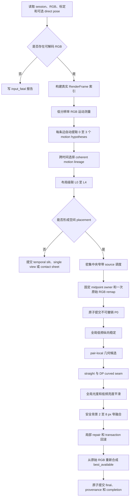

# Panoramic Camera S1.3 v3 出图优先的渐进式密集中央窄带合并实施方案

## 面向 Codex 的可直接执行版本

```text
仓库：D:\central_strip_Panoramic_Camera
开发分支：codex/video-realtime-seam-v6
算法 ID：S013_output_first_progressive_dense_central_slit_v3
角色：独立 diagnostic candidate
研发入口：g305-video-experiment --algorithm candidate
验证数据：slow 与 fast
production renderer：不得修改
production lock：不得修改
S1、S1.1、S1.2 历史输出：不得作为运行输入
```
```text
有没有真实 RGB
决定能否输出可视资产

有没有稳定图像推进或真实 pose
决定输出是什么类型

真实性、拓扑和 provenance
决定能否称为全景

视觉质量
只决定采用 P0、P1、P2 还是 P3

正式审计与人工确认
决定能否进入后续 production 讨论
```

这样既不会因为 pose 或 motion gate 缺失而完全没有图，也不会把时间顺序窄条或单帧错误地称为空间全景。

---

# 1. 最终目标与优先级

## 1.1 固定优先级

```text
第一优先级：只要有可解码真实 RGB，就输出语义正确的可视资产
第二优先级：有空间推进证据时，生成完整密集中央窄带全景
第三优先级：减少横线阶梯、近景错层、重复边缘和断裂
第四优先级：使用弯曲接缝避开强结构和遮挡边界
第五优先级：消除白墙、横梁和物体内部的亮度梯度
第六优先级：在不破坏前面目标的条件下提高速度
```

## 1.2 输出优先契约

只要至少有一张可解码真实 RGB，运行必须尝试原子提交一种可视资产。

| 条件 | 资产类型 | 是否称为 panorama |
| --- | --- | --- |
| 至少两个真实 RGB，RGB motion 可形成稳定单调空间进度 | `rgb_motion_spatial_panorama` | 是，但 `panorama_claim=visual_nonmetric` |
| 至少两个真实 posed sources，可形成 L0、L1 或 L2 空间布局 | `pose_supported_spatial_panorama` | 是，`panorama_claim=pose_supported` |
| 只有部分 pose islands | 每个 island 独立空间 panel，加导航 overview | panel 是局部 panorama，overview 不是 |
| 有多帧但不能建立空间推进 | `temporal_slit_preview` 或 contact sheet | 否 |
| 只有一帧 | `calibrated_single_view` 或 raw single view | 否 |
| session 不可信但 RGB 可读 | `untrusted_rgb_preview` | 否，或仅标为 untrusted visual mosaic |
| 连一个 RGB 像素都不能读取 | 结构失败报告 | 无图 |

不允许为了满足“总要有图”而伪造 pose、虚构 RGB、复制帧填补空间或把时间拼条冒充空间全景。

## 1.3 最低真实性条件

每一个输出像素必须满足以下之一。

1. 来自一张真实输入 RGB source 的一次正式采样。
2. 来自两张相邻真实 RGB source 的明确融合，并保存两者贡献。

禁止使用：

- 虚拟 RGB source。
- foreign fill。
- TSDF 回传颜色。
- 点云投影补色。
- 相邻帧颜色复制补洞。
- 生成式补图。

---

# 2. 历史失败经验怎样进入 v3

## 2.1 V6 与 V6.1

保留：

- RGB 差异、梯度、光流残差和对象边缘可以构成 seam 风险。
- GraphCut 失败应回到 hard owner。
- 颜色校正和几何校正应分开。
- 最终 source 只做一次正式采样。

删除：

- 物体越宽，owner 越宽。
- GraphCut 修复大视差。
- 宽 MultiBand 掩盖双边。
- 前一个 pair 改过的 grid 继续传给下一个 pair。
- 指标未过就不渲染。

## 2.2 S1 与 S1.1

保留：

- S0 或 P0 始终存在。
- missing window 归零。
- pair 失败只影响当前 pair。
- 低分辨率分析，全分辨率一次采样。
- 非重叠 support 和 joint remap。
- 分阶段图、固定 crop 和 provenance。

升级：

- 基础推进不再依赖单一平移。
- motion hypothesis 允许 0 至 3 个。
- straight seam 升级为 straight 加 DP curved seam。
- 纵向校正改为全局低频与局部残差的两级模型。

## 2.3 S1.2

保留代码和工程资产：

- v2 direct-pose 验证原语。
- scan 与 source 审计原语。
- exact owner schedule。
- source-u/source-v provenance。
- ROI renderer。
- staging、SHA-256、原子 completion。
- failure bundle。

删除其发布权：

- motion graph 连通门。
- direct/local 2 px 门。
- anchor 双路径一致门。
- minimum span、minimum node 门。
- 24 px internal strip fatal。
- Open3D、held-out 或性能门先于 P0。

slow 的 `7.43485 px` 和 fast 的 disconnected graph 必须保留为 telemetry，但不得产生 structural fatal。

---

# 3. 硬结构条件与软质量证据

## 3.1 只有以下情况可以完全没有可视资产

- 没有任何可解码 RGB。
- 所有图像尺寸或编码均非法。
- 输出目录无法写入。
- 内存或资源错误导致单帧也无法提交。
- completion 和 pointer 均无法原子写入。

## 3.2 空间 P0 的硬条件

- 至少两个真实 RGB sources。
- 可以得到有限、顺序确定的 source placement。
- 每个有效像素有且只有一个 primary owner。
- owner 指向真实 frame_id。
- source-u/source-v 有限并位于源图范围内。
- 无 duplicate write。
- 无虚拟 RGB 和颜色补洞。
- canvas 可构造，或可分成真实 panels。
- P0 文件、hash 和 completion 原子提交成功。

直接 pose 不是 `rgb_motion_spatial_panorama` 的硬条件，但它是 `pose_supported` 等级的条件。

## 3.3 优化变换的硬安全条件

以下条件只决定某次修正能否应用，不决定 P0 是否存在。

- 变换有限。
- inverse map 位于合法范围。
- Jacobian 为正。
- support 边界回到 identity。
- 相邻 pair application band 不重叠。
- seam 单调且不交叉。
- owner 拓扑唯一。
- blend 最多包含两个真实 source。
- protected structure 不被融合。

失败时回滚当前 transaction。

## 3.4 全部改为软证据的量

- direct/local 差值。
- anchor/local 差值。
- motion graph 是否连通。
- inlier ratio、FB error、coverage、vertical span。
- parallax cluster ratio。
- Open3D audit。
- fixed crop、held-out 和 line residual。
- ghost、double-edge、seam step。
- 20 秒或 60 秒性能目标。

这些量只能影响：

- layout 模式。
- motion hypothesis 分数。
- pair 风险。
- optimizer 候选排序。
- visual grade。
- manual review 优先级。

---

# 4. 产品状态和资产语义

## 4.1 渐进阶段

| 阶段 | 名称 | 主要内容 |
| --- | --- | --- |
| P0 | Base | 密集中央窄带、固定中点 hard owner、无局部 warp、无颜色校正、无融合 |
| P1 | Geometry | 全局低频纵向稳定、pair-local row residual、小位移或轻仿射 |
| P2 | Seam | straight、shifted straight、DP curved seam，可选 GraphCut |
| P3 | Visual | 全局 gain/bias、受限低频亮度场、安全背景窄融合 |
| P4 | Repair | 局部 source 重选、seam 重算、模型降级和问题区域回滚 |
| P5 | Reviewed | 人工确认 best_available，不改变像素 |

## 4.2 状态字段

```text
render_state:
  base_generated
  optimized_partial
  optimized_complete
  temporal_preview_only
  single_view_only
  untrusted_preview_only
  input_fatal
  render_fatal
  publication_fatal

panorama_claim:
  pose_supported
  visual_nonmetric
  partial_pose_island_only
  none

trust_state:
  strict_session_and_pose
  strict_session_rgb_motion
  readable_rgb_untrusted_metadata
  invalid_input

review_state:
  not_reviewed
  manual_review_required
  visual_review_accepted
  visual_review_rejected
```

所有 S1.3 v3 产物固定：

```text
diagnostic_only = true
production_eligible = false
production_lock_eligible = false
manual_review_required = true
```

---

# 5. 总体处理流程



P0 必须在任何昂贵优化之前提交。

---

# 6. 输入、轨迹与 Depth 的准确边界

## 6.1 RGB 是唯一必需的颜色来源

建议模块：

```text
src/panorama_demo/video_s13_session.py
```

处理顺序：

1. 尝试严格加载 session、manifest、frames.csv 和标定。
2. 严格加载失败时，进入只读 RGB salvage。
3. 跳过损坏帧，记录 gap。
4. 标定有效时在标定目标域工作。
5. 标定缺失或 map 构造失败时，使用 `raw_rgb_fallback`。
6. raw fallback 只能降低 trust grade，不能阻止可视资产。

## 6.2 ORB-SLAM3 的使用范围

轨迹来源必须显式选择：

```text
--trajectory-cache PATH
--reuse-online-trajectory
--run-offline-orb
--ignore-pose
```

规则：

- 不复制、不插值、不外推 pose。
- 不读取 ORB-SLAM3 内部特征点。
- 不用相机平移米数直接得到唯一像素推进量。
- pose 用于扫描方向、显式 epoch、纯旋转预补偿和低频趋势。
- direct pose 缺失不阻止 RGB motion P0。
- pose 不完整时，pose-supported claim 只能覆盖合法 island。
- RGB motion 可以跨越 pose 缺失区生成 `visual_nonmetric` 预览，但不能伪装为 pose-supported。

## 6.3 Depth 的使用范围

默认配置：

```yaml
depth_assist:
  enabled: false
```

即使 session 是 RGB-D，P0 和主优化也不得依赖 Depth。

明确禁止：

- Depth 生成颜色。
- 点云或 TSDF 生成颜色。
- Depth 替代 pose。
- Depth 决定全局 layout。
- 深度孔洞导致 P0 失败。

后续得到真实证据并单独启用后，Depth 只能在 pair corridor 中产生软风险：

- 深度边缘风险。
- 遮挡侧提示。
- 前后景混合提示。
- 局部 warp 禁用提示。

Depth 辅助失败时，结果必须与 `depth_assist.enabled=false` 的 P0 完全相同。

第一版不实现 depth-driven mesh。

---

# 7. P0-A：RGB 局部运动测量

建议模块：

```text
src/panorama_demo/video_s13_motion.py
```

## 7.1 帧对

至少计算：

- 相邻可用帧 step 1。
- skip step 2 和 4。

相邻边负责完整顺序。skip 边只提供软累计约束。

## 7.2 分析域预处理

- 默认分析宽度 424 px。
- 灰度、Sobel 梯度和纹理分数。
- 标定可用时在标定分析域计算。
- 两帧都有 direct pose 时，可用 `K R K^-1` 去除纯旋转。
- pose 不可用时直接继续。
- analysis 像素立即换算为 output 像素。

## 7.3 网格 LK

使用规则网格，避免背景角点完全压制近景。

建议：

```text
网格尺寸：24 至 32 analysis px
每格 GFTT：2 至 4 个点
横向范围：中央 70%，必要时扩展到 80%
纵向范围：全高
```

前后向误差使用连续权重，不使用整条边硬拒绝。

```python
w_fb = exp(-0.5 * (fb_error / sigma_fb) ** 2)
w_lk = exp(-0.5 * (lk_error / sigma_lk) ** 2)
w = texture_weight * central_weight * w_fb * w_lk
```

只有非有限、越界和无法建立对应关系的点被删除。

## 7.4 Phase correlation

在中央宽 ROI 上提供一个全局候选。

用途：

- LK 稀疏时 fallback。
- 判断运动方向。
- 识别明显错误峰值。

它不能代替局部多运动假设。

## 7.5 DIS

DIS 不在全部 pair 上默认运行。

触发条件：

- LK 总权重低。
- 候选峰值难分。
- 当前 seam 仍有明显局部残差。
- audit 模式要求额外证据。

DIS 只按规则网格抽样为 observations。不得直接把自由 dense flow 当作最终 warp。

---

# 8. P0-B：自动提取 0 至 3 个运动假设

## 8.1 不固定 K=3

```yaml
maximum_motion_hypotheses_per_edge: 3
```

实际可以是 0、1、2 或 3 个。

禁止固定 K 的 K-means。

## 8.2 提取算法

每条边执行：

1. 对 canonical horizontal advance 建立加权直方图或一维 KDE。
2. 使用 0.5 至 1.0 output px bin。
3. 对直方图做轻微平滑。
4. 查找全部局部峰值。
5. 围绕峰值按局部 MAD 收集 observations。
6. 使用加权中位数或 Huber IRLS 重估 `advance_px` 和 `dy_px`。
7. 计算空间覆盖、最大连通分量、中央支持和纵向跨度。
8. 合并运动量和空间支持都高度相似的重复候选。
9. 按综合分和候选差异选择最多三个。

综合分包括：

- 有效支持权重。
- 中央区域支持。
- 内部残差。
- 空间连贯性。
- 纹理质量。
- phase soft agreement。
- pose 方向 soft agreement。
- 前后边时间连续性。

第二和第三候选不能只是第一候选的小幅重复。

## 8.3 数据结构

```python
@dataclass(frozen=True)
class S13MotionHypothesis:
    hypothesis_id: int
    advance_px: float
    vertical_shift_px: float
    support_weight: float
    residual_mad_px: float
    central_support: float
    spatial_coverage: float
    largest_component_ratio: float
    vertical_span: float
    support_centroid_xy: tuple[float, float]
    support_signature_sha256: str
    source_method: str
    confidence: float
```

代码统一使用 `motion_hypothesis` 或 `parallax_hypothesis`。

不得把它命名为真实物理深度层。

## 8.4 跨 pair coherent lineage

上传方案中“同一整链不能逐 pair 任意换运动层”必须保留。

整段 DP 或 Viterbi 状态由当前 edge 的 hypothesis 或 fallback 构成。

转移代价包括：

- advance 变化速度。
- dy 变化速度。
- support centroid 变化。
- support signature 相似度。
- 中央支持是否突然消失。
- pose 方向一致性。
- skip edge 累计一致性。

禁止：

```text
pair 1 选墙面
pair 2 突然选软管
pair 3 又选墙面
```

除非 support lineage 和图像证据表明确实发生了可解释的主导区域切换。

每次切换必须记录 `lineage_switch_cost` 和原因。

---

# 9. P0-C：完整推进序列与布局级联

建议模块：

```text
src/panorama_demo/video_s13_progress.py
src/panorama_demo/video_s13_layout.py
```

## 9.1 ORB pose 不能直接给像素推进量

只有在可靠 RGB 区间中，才可以拟合：

```python
pixels_per_meter = weighted_median(
    measured_advance_px / rail_delta_m
)
```

拟合不足时，pose 只提供方向和顺序。

## 9.2 每条相邻边必须有 placement 结果

fallback 顺序：

```text
F0 coherent RGB motion hypothesis
F1 pair phase correlation
F2 由 RGB 数据标定过的 pose 低频预测
F3 局部可靠 advance 中位数
F4 会话可靠 advance 中位数
F5 明确重复帧或暂停使用 0
F6 normalized pose progress
F7 temporal source order
```

F3 至 F7 都必须标记为 inferred placement，不得写成 direct pose。

## 9.3 布局级联

### L0：coherent_rgb_progress

条件：

- RGB motion 与 fallback 可以形成完整单调进度。
- coherent lineage 得分可用。

有无 direct pose 都可使用。

有 direct pose 时：

```text
panorama_claim = pose_supported 或 visual_nonmetric
```

取决于 owner source 的 pose 覆盖。

无 direct pose 时：

```text
panorama_claim = visual_nonmetric
```

### L1：rgb_pose_low_frequency_progress

条件：

- RGB 部分可靠。
- direct pose 足以提供长期趋势。
- 已从 RGB 拟合 pixels_per_meter。

RGB 决定局部推进，pose 只压制长期漂移。

### L2：normalized_pose_progress

条件：

- RGB motion 不足。
- 至少两个真实 direct poses 可形成扫描方向。

使用真实 pose 的归一化轨道进度，画布像素密度由标定宽度、source 数和资源预算决定。

报告：

```text
layout_confidence = low
metric_scale_claim = false
```

### L3：temporal_slit_preview

条件：

- 不能建立可靠空间尺度。
- 仍有多张真实 RGB。

按真实时间顺序，每帧取至少一列中央窄条。

该资产不是空间 panorama。

### L4：single_view_or_contact_sheet

- 单帧输出 single view。
- 多帧但 L3 也无意义时输出 contact sheet 和代表帧。

## 9.4 pose islands 与 RGB 跨岛预览

- 显式 `epoch_id` 或 `reset_id` 才能建立 pose islands。
- 不通过 pose jump 猜 tracking reset。
- 每个合法 island 可以生成 pose-supported panel。
- RGB motion 若能跨越 pose gap，可额外生成 `visual_nonmetric` 全段预览。
- 该全段预览不得升级为 pose-supported。

## 9.5 反向、停留和 gap

- 小幅负推进使用单调投影。
- 长停留允许零宽 source。
- 明显反向分成独立 scan segments。
- 默认选择累计视觉覆盖最大的 segment。
- 其它 segments 生成 panels 或附加 preview，不直接丢弃。
- 不设置 minimum node 或 minimum physical span 发布门。

---

# 10. P0-D：密集中央窄带 source 调度

建议模块：

```text
src/panorama_demo/video_s13_schedule.py
```

## 10.1 source 密度

目标推进间隔：

```text
普通区域：约 8 output px
高风险区域：约 5 output px
```

高风险依据：

- 多个明显 motion hypotheses。
- hypotheses 差异大。
- 中央强边缘多。
- FB error 高。
- phase 与 LK 差异大。
- placement 使用较低等级 fallback。

这些数值只控制选帧密度，不控制是否出图。

## 10.2 中间真实帧救援

相邻 source 间距过大时：

1. 在两者时间范围内搜索尚未使用的真实 RGB。
2. 选择 progress 最接近目标位置的帧。
3. 插入后重新计算相邻关系。
4. 重复，直到无法进一步缩短 gap。
5. source 变化必须创建新 generation，不得静默改写已提交 P0。

## 10.3 中央 source-u 安全范围

默认：

```yaml
maximum_internal_source_u_span_fraction: 0.20
```

这不是 P0 pass/fail 门，而是防止恢复 V6 宽 owner 的策略边界。

当 gap 需要超过该范围时：

1. 优先插入真实中间帧。
2. 尝试降低 canvas 像素密度，但不得整体模糊原图。
3. 仍无法满足时切分 spatial panels。
4. 生成低分辨率导航 overview。
5. overview 中的 gap 必须显式标注，不能用邻帧虚假填满。

## 10.4 固定 midpoint owner

相邻 source centers 为 `c_i` 和 `c_{i+1}`。

```python
b_i = 0.5 * (c_i + c_{i+1})
```

内部 owner 使用半开区间。

- 每列恰好一个 primary owner。
- 重复 source 可以得到零宽 owner。
- 首 source 只向扫描外侧保留 FOV。
- 尾 source 只向扫描外侧保留 FOV。
- 宽物体由多张连续窄带共同组成。

---

# 11. P0-E：基础渲染与立即发布

建议模块：

```text
src/panorama_demo/video_s13_base_renderer.py
src/panorama_demo/video_s13_bundle.py
```

P0 只包含：

- 真实 RGB。
- 标定 map 或 raw fallback。
- 基础 placement。
- midpoint hard owner。
- 零局部 warp。
- 零 gain/bias。
- 零融合。
- 完整 owner/source-UV provenance。

每个实际贡献 source 在该 P0 资产中只做一次全分辨率 inverse remap。

立即提交：

```text
P0/base_panorama_owner_only.png
P0/base_panorama_owner_only.jpg
P0/base_valid_mask.png
P0/base_pixel_provenance.npz
P0/base_column_provenance.npz
P0/base_layout.json
P0/base_sources.csv
P0/P0_completion.json
```

之后原子更新：

```text
current_base.json
```

优化器全部抛异常时，P0 文件和 hash 必须保持不变。

---

# 12. P1：两级纵向校正

这是两份方案中最需要折中的部分。

## 12.1 第一层：全局低频 source dy

建议模块：

```text
src/panorama_demo/video_s13_vertical.py
```

每个 source 只求一个全局低频标量：

```text
g_i = global_vertical_offset_px
```

从相邻和少量 skip source 的多个水平窗口中建立：

```text
g_j - g_i = observed_dy_ij
```

使用 Huber IRLS，固定一个 gauge。

目标包含：

- 数据一致项。
- source 二阶平滑。
- evidence 不足时回到 0 的弱先验。

第一版不使用全图自由 `v_i(y)` B-spline，避免 rubber-sheet。

候选增益：

```text
0.0、0.25、0.5、1.0
```

0.0 必须存在。

## 12.2 第二层：pair-local 随高度残差

每个相邻 pair 在自己的 Geometry Application Band 中求：

```text
r_i(y)
```

它只修复不同高度的局部剩余 dy。

要求：

- 从 immutable P0 source grids 估计。
- 不使用前一 pair 已修改的 grid。
- support 在边界连续回到 0。
- 左右 pair support 不重叠。
- missing row 为 0。
- 长缺口不外推。
- 前景、遮挡、细线和不稳定区域权重降低或归零。

最终纵向位移：

```text
g_i + pair_local_r_i(y)
```

这样既能控制整条横梁的累计台阶，又不会让全图随意弯曲。

## 12.3 提交规则

- 拓扑和 provenance 不变。
- 局部 protected structure 不劣于 P0。
- 不确定时使用 0。
- 全图组合后再做一次非劣化审计。
- 发现全局退化时回滚最小 transaction 集，而不是取消 P1。

---

# 13. P2-A：局部几何候选

建议模块：

```text
src/panorama_demo/video_s13_alignment.py
```

## 13.1 第一版候选

```text
C0 identity
C1 global dy + pair-local row residual
C2 subpixel translation
C3 translation + tiny rotation
C4 bounded light affine
```

`bounded_local_mesh` 不进入第一版必需范围。

## 13.2 估计区和应用区分离

### Alignment Shoulder

- 用于分析两张 source。
- 总宽建议 64 至 128 px。

### Geometry Application Band

- 真正修改 sampling grid。
- 围绕最终 seam。
- 必须比 shoulder 窄。
- 相邻 pair 不重叠。
- 在边界连续回到 identity。

## 13.3 reference side

根据以下信息选择 reference source：

- 更接近光轴中心。
- 更清晰。
- 有效像素更多。
- 当前 motion hypothesis 支持更高。
- 遮挡侧更合理。

只让非 reference side 在 application band 内轻微对齐。

## 13.4 motion hypothesis 与局部模型

每个 motion hypothesis 可以产生一组 C2 至 C4 候选。

候选只改变 seam 附近的局部采样，不改变全局 source progress。

回退：

```text
C4 affine
C3 tiny rotation
C2 translation
C1 vertical
C0 identity
```

数值不安全只淘汰当前候选。

---

# 14. P2-B：straight 与 DP 弯曲接缝

建议模块：

```text
src/panorama_demo/video_s13_seam.py
```

## 14.1 接缝解决的问题

接缝只决定：

```text
左 source 在哪里结束
右 source 从哪里开始
```

它不能修复 10 至 20 px 大视差。

正确顺序：

```text
密集真实 source
局部几何对齐
弯曲接缝
极窄融合
```

## 14.2 Seam Search Band

设基础边界为 `b_i`。

```python
left_limit_i = 0.5 * (b_{i-1} + b_i)
right_limit_i = 0.5 * (b_i + b_{i+1})
search_left_i = max(left_limit_i, b_i - max_seam_shift_px)
search_right_i = min(right_limit_i, b_i + max_seam_shift_px)
```

建议：

```text
max_seam_shift_px = 4 至 8 px
```

这样可以保证相邻 seam 不交叉。

## 14.3 候选顺序

```text
S0 基础 midpoint 直线
S1 search band 内最佳直线
S2 monotone DP curved seam
S3 可选 GraphCut
```

第一轮只必须实现 S0 至 S2。

## 14.4 代价图

先做只用于分析的局部颜色归一化。

代价包括：

- 颜色差异。
- 梯度幅值差异。
- 梯度方向差异。
- 双边缘风险。
- motion residual。
- 遮挡和显露风险。
- 细线、线缆、门框、横梁等强结构不一致风险。
- 偏离基础边界的代价。

所有分量在当前 shoulder 内按 median 和 MAD 归一化。

不使用大面积无限禁止 mask。风险只产生较高有限代价。

## 14.5 单调 DP

每一行只有一个 seam x。

允许步长：

```text
-1、0、+1 px
```

状态保存前一步方向：

```text
D[y, x, step]
```

转移包括：

- 当前 pixel cost。
- 一阶 slope cost。
- 二阶 curvature cost。

回溯得到 `seam_x[y]`。

## 14.6 seam 与 geometry 必须共同提交

上传方案中这一点必须保留。

P1 的 midpoint geometry 可以作为分析候选。但最终 seam 如果移动，必须：

1. 从 immutable P0 source grids 重新建立 final corridor。
2. 在 final corridor 中重新估计或重心化局部 geometry。
3. 将 `final_geometry + final_seam` 作为同一个 pair transaction。
4. 两者同时 applied 或同时 rolled_back。

不得把旧 midpoint warp 顺序套到新的 seam 上。

## 14.7 GraphCut 和对象 transaction

GraphCut 只在 DP 仍无法处理复杂对象时进入后续阶段。

它必须满足：

- 两个真实 owners。
- owner 单调。
- 无 island 和碎片。
- 不穿越 hard guard。
- 失败回 midpoint 或 DP。
- 失败后不得扩大 owner。

跨 3 至 5 个 pair 的同一对象 owner transaction 属于后续 M7。

第一版先通过 DP、强结构 guard 和 P0 fallback 保证稳定，不把对象跟踪变成 P0 前置工作。

---

# 15. P3：颜色、亮度和平滑

建议模块：

```text
src/panorama_demo/video_s13_photometric.py
src/panorama_demo/video_s13_blend.py
```

## 15.1 全局线性 RGB gain/bias

在每个空间 panorama 或 panel 的 source 图上联合求解：

```text
R/G/B gain
R/G/B bias
```

训练像素只能来自：

- 共同有效区域。
- 安全背景。
- 非饱和区。
- 非反光区。
- 非遮挡区。
- 非强深度边缘或强 motion residual 区。

要求：

- 在线性颜色域求解。
- 固定参考或零均值 gauge。
- source 间有平滑正则。
- held-out 不参与拟合。
- 不改善时回到 identity。
- 不能产生累计亮度坡度。

## 15.2 受限低频亮度场

仅靠 source gain/bias 可能仍留下白墙竖条或局部 lens shading。

因此允许一个受限的 panorama-domain 低频亮度候选：

```text
L(x, y)
```

第一版规则：

- 只调整 luminance，默认不调整 chroma。
- x 方向控制点间距不小于 64 px。
- y 方向只使用 3 至 4 个 bands。
- 零均值 gauge。
- 强平滑正则。
- 幅度有安全上限。
- 只用安全背景估计。
- 高频边缘权重低。
- 只作用于低频分量。
- 0 correction 候选始终存在。

它不能用于修复几何错位。

## 15.3 高频 owner 与极窄 feather

高频纹理由 dominant owner 提供。

接缝处允许：

```text
0 至 2 px feather
```

强边缘、细线和遮挡边界使用 0 px。

## 15.4 安全背景 MultiBand

只有同时满足以下条件时启用：

- 两侧共同有效。
- 几何已对齐。
- 无遮挡。
- 无强结构 guard。
- 无明显 motion residual。
- 不与相邻 blend corridor 重叠。

参数：

```text
总带宽：2 至 8 px
最多 3 层
最多两个真实 source
```

权重由最终 seam 的 signed distance 生成。

禁止：

- 多列固定 50/50 平台。
- old/new 使用相同 mask 后整带平均。
- 全图 feather。
- 全图 MultiBand。
- 前景宽融合。
- 用 blur 单独换取指标改善。

---

# 16. P4：局部修复

建议模块：

```text
src/panorama_demo/video_s13_repair.py
```

只检查 seam 邻域：

- 横线阶梯。
- double edge。
- ghost。
- 细线中断。
- 清晰度突变。
- 亮度或颜色跳变。

动作顺序：

```text
重新选择 straight 或 DP seam
换另一个 coherent motion hypothesis
切换 translation、rotation 或 affine
降低或关闭局部 warp
关闭局部 blend
插入尚未使用的真实中间 source，并创建新 generation
回到 P0 owner
```

最多 1 至 2 轮。

禁止固定 frame_id、固定 crop 和场景名称分支。

---

# 17. 候选选择与 transaction 回滚

## 17.1 P0 永远是候选

每个局部区域至少有：

```text
P0 identity + midpoint owner
```

所有复杂候选只能与其 parent 比较。

## 17.2 绝对安全与相对画质分开

绝对安全项：

- provenance。
- owner 拓扑。
- map 有限。
- Jacobian。
- support 边界。
- blend source 数。

相对画质项：

- line step。
- double edge。
- ghost。
- missing。
- photometric jump。
- low-frequency slope。
- blur increase。
- warp complexity。
- seam curvature。

不使用 2 px 或其它单一固定画质门决定整图发布。

## 17.3 局部评分

每个指标在当前候选集合内按 median 和 MAD 归一化。

优先级：

```text
结构错位
ghost 和 double edge
protected structure 完整性
亮度跳变
模糊增加
模型复杂度
```

分数接近时选择更简单候选。

```text
identity 优先于 translation
translation 优先于 rotation
affine 只有明显净收益时采用
straight seam 优先于 DP
DP 优先于 GraphCut
owner-only 优先于 blend
```

## 17.4 transaction 记录

每个 pair transaction 至少保存：

```text
transaction_id
parent_stage_sha256
pair_frame_ids
motion_hypothesis_id
support_mask_sha256
geometry_model
seam_model
map_delta_sha256
decision
before_metrics
after_metrics
rollback_reason
result_stage_sha256
```

光度和 blend 使用独立下游 transaction，并绑定准确 parent hash。

任何 parent 变化都会使下游 transaction 失效。

---

# 18. 最终 sampling grid 与 provenance

## 18.1 每个候选资产从原始 RGB 采样

P0、P1、P2、P3 是不同的全分辨率审计候选。

每个候选都必须：

1. 合并标定 map。
2. 合并基础 placement。
3. 合并全局 dy。
4. 合并 pair-local geometry。
5. 从原始 RGB 对每个 contributor source 正式采样一次。

禁止把已经渲染的 P0 再次 warp 成 P1 或 P2。

## 18.2 provenance 字段

所有空间 stage 至少保存：

```text
owner_frame_id
owner_source_index
assignment_index
source_u
source_v
valid
selected_motion_hypothesis_id
placement_method
geometry_transaction_id
seam_transaction_id
photometric_transaction_id
blend_transaction_id
```

融合像素额外保存：

```text
secondary_frame_id
secondary_source_u
secondary_source_v
secondary_weight
```

owner-only 像素：

```text
secondary_frame_id = -1
secondary_weight = 0
```

一个像素最多两个真实颜色 contributor。

## 18.3 pose 与 placement 分开

```text
pose_origin:
  direct_orb
  unavailable

placement_method:
  coherent_rgb_motion
  phase_correlation
  rgb_calibrated_pose_trend
  local_median
  session_median
  zero_duplicate
  normalized_pose
  temporal_order
```

fallback placement 不能写成真实 pose。

---

# 19. generation、stage seal 与原子发布

采用渐进式方案的不可变 generation 思路。

建议目录：

```text
S013_output_first_progressive_dense_central_slit_v3_preview/
├─ current_base.json
├─ current_preview.json
├─ current_nonpanorama.json
└─ generations/
   └─ GENERATION_ID/
      ├─ generation_manifest.json
      ├─ input_audit.json
      ├─ trajectory_audit.json
      ├─ P0/
      ├─ P1/
      ├─ P2/
      ├─ P3/
      ├─ P4/
      ├─ best_panorama.png
      ├─ best_panorama.jpg
      ├─ best_pixel_provenance.npz
      ├─ pair_report.json
      ├─ performance.json
      ├─ report.json
      └─ S013_preview_completion.json
```

规则：

1. P0 stage completion 写入后，P0 目录不可修改。
2. `current_base.json` 在 P0 completion 重新验证后原子替换。
3. 后续 stage 只追加，不覆盖已封存 stage。
4. source 集、layout 或 config 改变时创建新 generation。
5. final completion 是 generation 内最后写入。
6. final completion 成功后再更新 `current_preview.json`。
7. pointer 更新失败时，旧 pointer 保持有效，新 generation 是 unpublished orphan。
8. optimizer 崩溃不能删除旧 P0 和 current_base。
9. 不写 `video_delivery.json`、`delivery.json` 或任何 production lock。

首轮 M0 至 M3 可以先实现：

- generation manifest。
- P0 completion。
- current_base pointer。
- final completion。
- current_preview pointer。

完整 stage transaction seal 在后续里程碑补齐。

---

# 20. 配置草案

建议文件：

```text
configs/video_candidates/s013/S013_output_first_progressive_dense_central_slit_v3.yaml
configs/video_candidates/s013/candidate_manifest.json
```

核心配置：

```yaml
config_schema: gemini305-video-candidate/v1
role: candidate
candidate_id: S013_output_first_progressive_dense_central_slit_v3
parent_candidate_id: null
algorithm_id: S013_output_first_progressive_dense_central_slit_v3
implementation_id: s013_output_first_progressive_dense_central_slit_preview
allow_baseline_fallback: false

components:
  s013_output_first_progressive_dense_central_slit:
    contract_schema: gemini305-video-s13-output-first/v3
    diagnostic_only: true
    production_eligible: false

    truth:
      require_real_rgb_source: true
      allow_raw_rgb_fallback: true
      allow_interpolated_pose: false
      allow_extrapolated_pose: false
      allow_virtual_rgb_source: false
      allow_foreign_fill: false
      allow_synthetic_color_fill: false

    artifact_semantics:
      allow_pose_supported_panorama: true
      allow_rgb_motion_visual_nonmetric_panorama: true
      allow_temporal_slit_preview: true
      allow_single_view_preview: true
      never_label_temporal_preview_as_panorama: true

    depth_assist:
      enabled: false
      scope: pair_risk_only
      allow_color_generation: false
      allow_pose_replacement: false
      allow_global_layout: false
      allow_mesh_in_v3_mvp: false

    motion:
      analysis_width_px: 424
      adjacent_steps: [1]
      skip_steps: [2, 4]
      maximum_motion_hypotheses_per_edge: 3
      use_grid_lk: true
      use_phase_correlation: true
      dis_policy: risky_pairs_only
      fixed_kmeans_forbidden: true
      direct_local_delta_used_as_gate: false

    progress:
      coherent_lineage_dp: true
      use_pose_as_soft_prior_only: true
      allow_rgb_motion_without_pose: true
      fallback_order:
        - coherent_rgb_motion
        - phase_correlation
        - rgb_calibrated_pose_trend
        - local_median
        - session_median
        - zero_duplicate
        - normalized_pose
        - temporal_order

    schedule:
      normal_target_advance_px: 8
      risky_target_advance_px: 5
      base_owner_policy: fixed_midpoint
      preserve_first_last_outer_fov: true
      maximum_internal_source_u_span_fraction: 0.20
      overwide_gap_policy: real_source_rescue_then_scale_then_panel
      permit_owner_expansion_on_failure: false

    base:
      publish_before_optimization: true
      transition_width_px: 0
      color_gain_enabled: false
      local_warp_enabled: false
      blend_enabled: false
      atomic_publish: true

    vertical:
      global_scalar_dy_enabled: true
      global_gain_candidates: [0.0, 0.25, 0.5, 1.0]
      pair_local_row_residual_enabled: true
      pair_independent: true
      nonoverlapping_application_bands: true
      missing_rows_zero: true

    geometry:
      models:
        - identity
        - vertical
        - translation
        - tiny_rotation
        - light_affine
      alignment_shoulder_width_px: [64, 128]
      continuous_support_taper: true
      require_positive_jacobian_to_apply: true
      bounded_mesh_enabled: false

    seam:
      models:
        - midpoint_straight
        - shifted_straight
        - monotone_dp
      graphcut_enabled: false
      maximum_shift_px: 8
      require_non_crossing_seams: true
      final_seam_requires_final_corridor_geometry: true
      failure_policy: restore_parent_owner

    photometric:
      global_linear_rgb_gain_bias: true
      safe_background_only: true
      train_heldout_split: true
      low_frequency_luminance_field: true
      low_frequency_field_zero_candidate: true
      failure_policy: identity

    blend:
      enabled: true
      safe_background_only: true
      minimum_total_width_px: 2
      maximum_total_width_px: 8
      maximum_levels: 3
      maximum_color_contributors_per_pixel: 2
      failure_policy: owner_only

    selection:
      stage_a_always_candidate: true
      use_relative_non_degradation: true
      forbid_absolute_direct_local_gate: true
      forbid_blur_only_improvement: true
      report_all_pairs: true

    output:
      immutable_generations: true
      atomic_base_commit: true
      atomic_final_commit: true
      write_pixel_and_column_provenance: true
      write_all_stage_images: true
      write_fixed_and_worst_crops: true
      write_production_delivery: false
```

Validator 必须拒绝：

- 任意 2 px direct/local gate。
- `production_eligible=true`。
- virtual source。
- foreign fill。
- pose 插值或外推。
- P0 transition width 大于 0。
- GraphCut 失败后 owner expansion。
- depth 生成颜色。
- temporal preview 冒充 panorama。

---

# 21. 代码组织、入口和复用边界

## 21.1 新模块

| 文件 | 职责 |
| --- | --- |
| `video_s13_contract.py` | schema、状态、hard/soft 分类 |
| `video_s13_session.py` | strict load、RGB salvage、标定和输入审计 |
| `video_s13_trajectory.py` | 显式 trajectory source 和 direct pose 审计 |
| `video_s13_motion.py` | LK、phase、可选 DIS 和 motion hypotheses |
| `video_s13_progress.py` | coherent lineage、fallback 和完整进度 |
| `video_s13_layout.py` | L0 至 L4、pose islands、panels 和资源规划 |
| `video_s13_schedule.py` | 密集 source 选择和 midpoint owner |
| `video_s13_base_renderer.py` | P0 一次 remap 和 provenance |
| `video_s13_vertical.py` | global scalar dy 和 pair-local row residual |
| `video_s13_alignment.py` | translation、rotation、affine candidates |
| `video_s13_seam.py` | shifted straight、DP seam 和 topology audit |
| `video_s13_photometric.py` | gain/bias 和低频亮度场 |
| `video_s13_blend.py` | signed-distance 安全窄融合 |
| `video_s13_repair.py` | 局部重算和 source rescue |
| `video_s13_quality.py` | 全体 pair 指标和相对选择 |
| `video_s13_bundle.py` | generation、completion、hash 和 pointer |
| `video_s13_experiment.py` | development-only 编排 |

## 21.2 优先复用

- S1.2 的 direct pose validator。
- S1.2 的 exact owner、source-UV 和 ROI renderer 原语。
- S1.2 的 staging、SHA-256 和 completion 原语。
- S1 的 missing-to-zero 纵向观测原语。
- S1.1 的 non-overlap support 和 joint remap 原语。
- 现有 DIS 分析原语。
- 现有 GraphCut、photometric 和 blend 的底层 primitive。

复用纯函数，不读取历史产物。

## 21.3 禁止运行时耦合

S1.3 v3 不得读取：

- S1 report、layout、canvas 和图像。
- S1.1 baseline、lineage 和边界。
- S1.2 failure bundle、success bundle、motion graph、anchor、layout、completion 和 lock。
- production lock。
- 历史全景像素。

历史数据只能用于人工对比和回归基准。

## 21.4 研发入口

继续使用：

```text
g305-video-experiment --algorithm candidate --candidate-config ...
```

在 `video_experiment.py` 中按经过 manifest 验证的精确 candidate identity 分流。

分流必须发生在：

- production facade。
- `run_video_algorithm`。
- production lock loader。
- legacy renderer。

之前。

单元测试应将这些共享发布入口替换为“被调用即失败”。

---

# 22. 分阶段实施计划

## M0：冻结契约和隔离路线

完成：

- 新 algorithm ID、config 和 sibling manifest。
- 禁止 2 px gate 的 schema 测试。
- development-only dispatch。
- 旧 S1/S1.1/S1.2/production 文件零改动。

验收：

- S1.3 不调用 production facade。
- 共享 candidate manifest hash 不变。
- 旧测试行为不变。

## M1：输入、轨迹和语义正确的 fallback

完成：

- strict session load。
- RGB salvage。
- raw RGB fallback。
- direct pose audit。
- pose islands。
- single view、temporal preview 和 contact sheet。

验收：

- no pose 仍有图。
- temporal preview 不称为 panorama。
- Depth 全零不影响 RGB preview。

## M2：最小可用 P0

完成：

- grid LK。
- phase correlation。
- 基础相邻 fallback。
- 简化 progress chain。
- 密集 source 调度。
- midpoint owner。
- P0 renderer、provenance、completion 和 current_base。

真实运行：

- slow。
- fast。
- `--ignore-pose`。
- optimizer-all-fail。

到 M2 必须向用户交付 P0，不等待后续算法。

## M3：完整 motion hypotheses 与 coherent lineage

完成：

- 0 至 3 hypotheses 自动提取。
- support signature。
- coherent lineage DP。
- RGB 加 pose 低频两遍求解。
- L0 至 L4 完整级联。
- 20% source-u cap 和 panel fallback。

验收：

- slow 不受 7.43485 px 阻塞。
- fast 不受 disconnected graph 阻塞。
- 无 pose 的 RGB motion panorama 标为 visual_nonmetric。

用户确认 P0 总体形态后，才继续 M4。

## M4：两级纵向校正

完成：

- global scalar dy graph。
- pair-local row residual。
- non-overlap support。
- pair transaction 和局部回滚。

验收：

- 横梁累计台阶相对 P0 改善或不劣。
- 不出现新的 support 边界硬折线。
- 不串联修改 source grid。

## M5：局部几何和 DP curved seam

完成：

- identity、translation、tiny rotation、affine。
- alignment shoulder 和 application band。
- shifted straight。
- monotone DP seam。
- seam 与 final-corridor geometry 原子 transaction。

验收：

- seam 不交叉。
- DP 失败回 straight。
- geometry 失败回 identity。
- 强结构不比 P0 更差。

## M6：光度和安全融合

完成：

- 全局 RGB gain/bias。
- held-out。
- 受限低频 luminance field。
- 0 至 2 px feather。
- 2 至 8 px safe MultiBand。

验收：

- 白墙和物体内部亮度跳变下降。
- 低频坡度不增加。
- 模糊宽度不增加。
- 无安全背景时 owner-only。

## M7：证据驱动的复杂功能

只有 M5、M6 的真实结果证明仍有必要时实施：

- GraphCut。
- 多 pair object component transaction。
- 可选 Depth 风险辅助。
- bounded local mesh。
- source rescue generation。

不得因为文档中存在这些功能，就在首轮全部实现。

## M8：best_available、完整报告和 evaluation lock

完成：

- transaction DAG。
- 全体 pair 报告。
- worst seam crops。
- final completion 和 current_preview。
- 代码、配置、数据和报告 hash-bound evaluation lock。

该 lock 不是 production lock。

## M9：性能优化

顺序：

- 先测 time_to_P0。
- 再测 motion、P1、P2、P3 和 export。
- DIS 只处理风险 pair。
- 低分辨率候选，最终一次 full-resolution sampling。
- tile streaming 控制内存。
- 预算耗尽只停止可选优化，保留 P0。

---

# 23. 必须新增的测试

## 23.1 输出和语义

- 一张 RGB 输出 single view。
- 多张 RGB、无 pose、motion coherent 输出 `visual_nonmetric` panorama。
- 多张 RGB、无空间 progress 输出 temporal slit，不称为 panorama。
- direct pose 完整时可标 pose-supported。
- partial pose islands 输出独立 panels。
- invalid session 但 RGB 可读时输出 untrusted preview。
- 没有可读 RGB 才 input_fatal。

## 23.2 no-2px 契约

- config/schema 不含 direct/local maximum difference。
- 构造 0、2、8、20 px delta，P0 像素和 completion 不变。
- delta 只能改变 telemetry 和 risk。
- 静态搜索禁止 `within_2px` 同义分支。

## 23.3 motion hypotheses

- 单一运动只输出一个候选。
- 两层运动输出两个候选。
- 三层运动最多三个。
- 固定 K=3 被 validator 拒绝。
- 随机散布异常点不能占满候选名额。
- 重复峰值被合并。
- coherent lineage 不逐 pair 随机换层。

## 23.4 progress 和 layout

- motion graph 全断仍能进入 fallback。
- fast disconnected graph 仍生成 P0。
- pose 只提供 soft trend。
- 未经 RGB 标定的 pose 米数不能直接变像素。
- 反向段分 segment。
- pause source 可以零宽。
- 超过 20% source-u 时插帧或分 panel，不扩大 owner。

## 23.5 P0 renderer

- valid 等价 owner >= 0。
- invalid owner=-1。
- owner 只能是真实 frame_id。
- source-u/source-v 合法。
- duplicate write=0。
- 黑色有效像素不被删除。
- 每 source 每候选正式 remap 一次。
- optimizer 故障不改变 P0 hash。

## 23.6 纵向、geometry 和 seam

- global dy 有 0 候选。
- missing row 为 0。
- pair support 不重叠。
- geometry 从 immutable P0 grid 估计。
- seam 移动后 final corridor geometry 必须重算。
- seam 单调且不交叉。
- DP 失败回 straight。
- GraphCut 关闭时不影响 P0 至 P3。
- protected object 不退化。

## 23.7 photometric 和 blend

- held-out 不参与拟合和 seam 选择。
- gain/bias 失败回 identity。
- low-frequency field 有零候选。
- correction 不改变高频 edge ownership。
- blend band 外清晰度不下降。
- 常量红蓝测试无多列 50/50 平台。
- 一个像素最多两个 source。
- guard 内 blend 权重为 0。

## 23.8 发布和隔离

- P0 seal 后不可修改。
- pointer 更新失败保留旧 pointer。
- source rescue 创建新 generation。
- S1/S1.1/S1.2 输出存在、缺失或内容改变，S1.3 核心像素 hash 不变。
- production facade 被调用即测试失败。
- 不产生 video_delivery 或 production lock。

---

# 24. 两组真实数据的首轮预期

## 24.1 slow：run_20260806_153033

已知：

```text
scan = 54–701
nodes = 100
adjacent reliable = 99/99
direct/local descriptive delta = 7.43485 px
```

预期：

1. 自动 motion hypotheses 正常提取。
2. L0 coherent RGB progress 形成完整布局。
3. 7.43485 px 只写 telemetry。
4. 立即提交 P0。
5. P1 检查横梁和长横线累计台阶。
6. P2 使用 DP seam 避开线缆、箱体和风扇边缘。
7. P3 处理白墙和物体内部亮度跳变。
8. 不读取历史 S1/S1.1/S1.2 图像。
9. 不特判任何 frame。

## 24.2 fast：run_20260807_140140

已知：

```text
scan = 31–128
nodes = 98
adjacent reliable = 50/97
motion graph = disconnected under S1.2 rules
```

预期：

1. 不因 reliable graph disconnected 停止。
2. 相邻 edge 通过 motion hypothesis、phase 和 fallback 形成完整进度。
3. 有 direct pose 时优先 L1 RGB 加 pose 低频趋势。
4. RGB 足够时仍可选择 L0。
5. 低可信 pair 保留 P0 hard owner。
6. 高风险区域 source 选择更密。
7. 真实中间帧用尽后不恢复宽 owner。
8. P0 先发布，后续优化逐 pair 回滚。

## 24.3 必须并排交付

每组至少交付：

- P0 base。
- 当前 best_available。
- owner/source boundary overlay。
- motion hypothesis overlay。
- P1 前后横线 crop。
- DP seam overlay。
- fixed 和 worst 10 seams。
- pair 全量状态表。
- time_to_P0 和总耗时。

---

# 25. 性能原则

- 先保证 `time_to_P0`，再优化 total time。
- LK 和 phase 默认运行。
- DIS 只运行风险 pair。
- GraphCut、mesh 和 Depth assist 默认关闭。
- 所有候选先在低分辨率 patch 上评分。
- final candidate 才从原始 RGB 正式采样。
- canvas 超过资源预算时 tile streaming 或分 panel。
- 超时只能得到 `published_degraded`，不能删除 P0。

性能报告至少分开：

```text
input_and_preflight
trajectory
motion_measurement
motion_hypotheses
progress_and_layout
time_to_P0
vertical
geometry
seam
photometric
blend
repair
artifact_export
total_wall_time
peak_memory
```

---

# 26. 完成定义

## 26.1 出图目标完成

- slow 和 fast 均提交 P0。
- fast 不再因 graph disconnected 停止。
- slow 不再因 7.43485 px 停止。
- no-pose RGB coherent 数据能生成 `visual_nonmetric` panorama。
- 无空间推进时输出语义正确的 temporal 或 single-view 资产。
- optimizer 全失败不改变 P0。
- P0 只有真实 RGB、唯一 owner 和完整 provenance。

## 26.2 自动优化目标完成

- P1、P2、P3 可以独立开关和回滚。
- 横线阶梯相对 P0 改善或不劣。
- fixed objects 不比 P0 更差。
- seam 不交叉。
- double-edge、ghost 和 brightness jump 相对 P0 改善或不劣。
- 改善不依赖裁剪、固定帧或全图模糊。

## 26.3 肉眼无明显接缝

该结论只能由完整图、fixed crops 和 worst seams 的人工复核给出。

在用户确认前：

```text
manual_review_required = true
production_eligible = false
```

## 26.4 正式产品

不在本方案范围内。

需要另行定义：

- production algorithm ID。
- production schema。
- production.lock。
- SLA。
- 正式 delivery。

---

# 27. 绝对禁止项

1. 不得重新引入 2 px 或同义 direct/local gate。
2. 不得把 motion graph disconnected 判为 P0 fatal。
3. 不得把多运动层判为结构错误。
4. 不得固定 K=3。
5. 不得逐 pair 随意切换 motion layer。
6. 不得从 pose 米数直接得到唯一像素推进量。
7. 不得复制、插值或外推 pose。
8. 不得让 Depth、Open3D、GraphCut、held-out 或性能决定 P0 是否存在。
9. 不得使用 Depth、点云或 TSDF 生成颜色。
10. 不得根据物体宽度扩大单 source owner。
11. 不得在 gap 中使用 virtual RGB 或 foreign fill。
12. 不得串联使用前一 pair 已修改的 source grid。
13. 不得把 midpoint geometry 直接套到已经移动的 final seam。
14. 不得使用全图 feather、全图 MultiBand 或全图自由 flow。
15. 不得在前景、遮挡、细线和强结构区域宽融合。
16. 不得只汇总 accepted pair。
17. 不得把不可评估指标写成 0。
18. 不得用固定 frame、crop 或场景名称分支。
19. 不得读取 S1/S1.1/S1.2 运行产物决定当前像素。
20. 不得写 production delivery 或 production lock。


# 28. 最终原则

```text
先保证真实像素可追溯
再生成语义正确的 P0
再用完整 RGB motion 和可选 pose 建立布局
再做全局低频纵向稳定
再做 pair-local 几何
再搜索窄范围弯曲接缝
再校正颜色和低频亮度
最后只在安全背景做极窄融合
```

核心契约：

> 有图不等于有空间全景，有空间全景不等于 pose 支持，有 pose 支持不等于视觉通过。S1.3 v3 必须先提交真实可追溯的 P0，再逐级提升画质。任何优化失败都不能让已经发布的 P0 消失。
